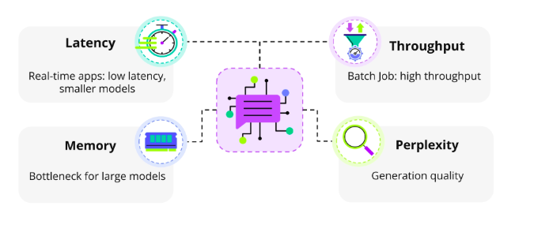
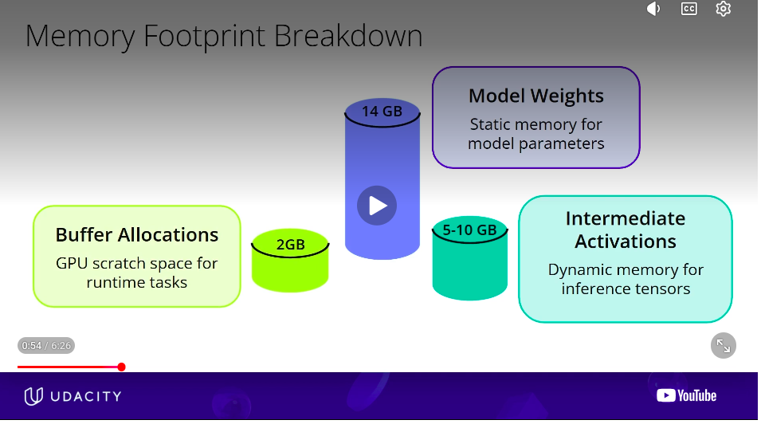
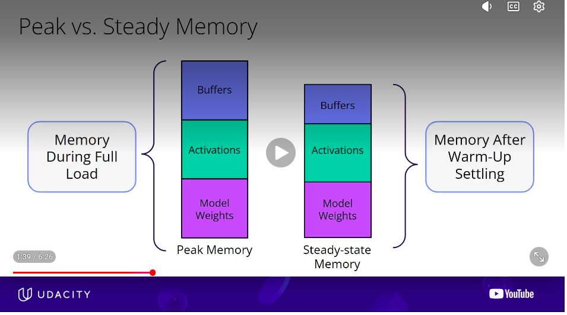
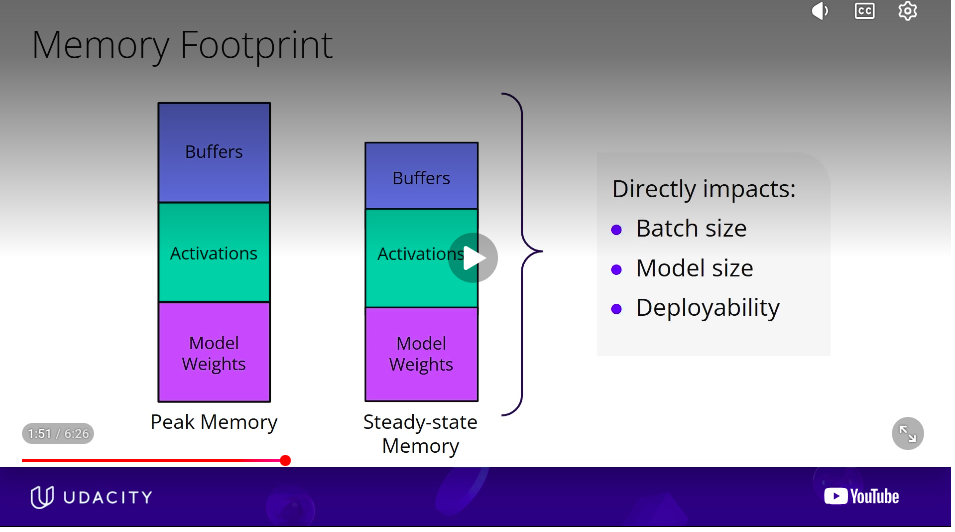
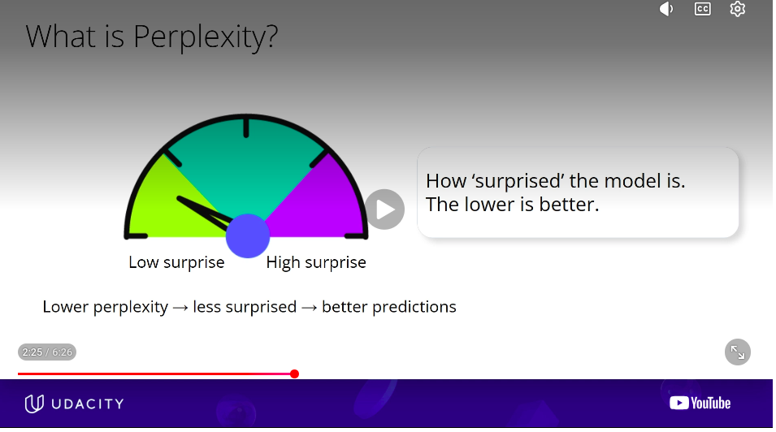
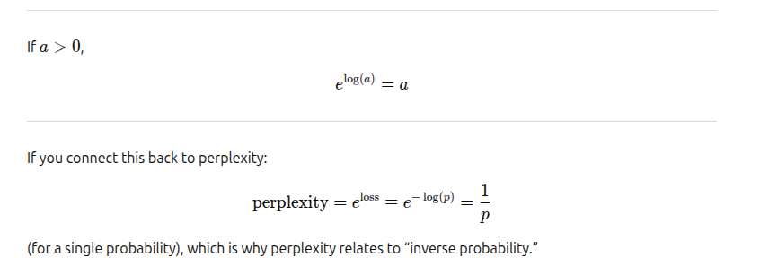
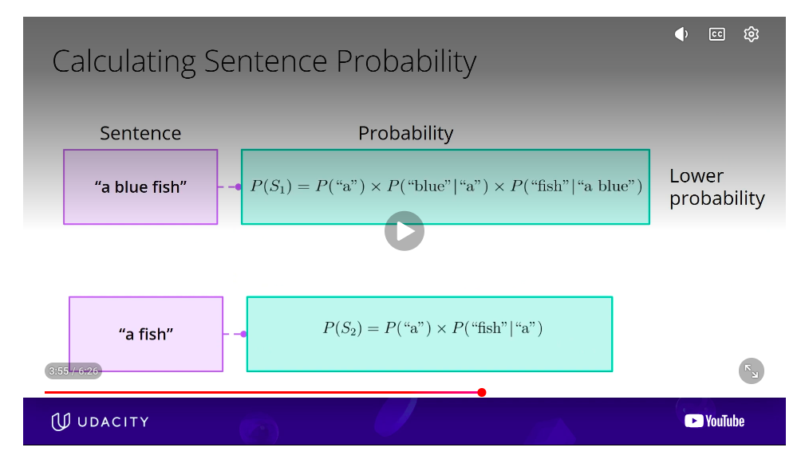
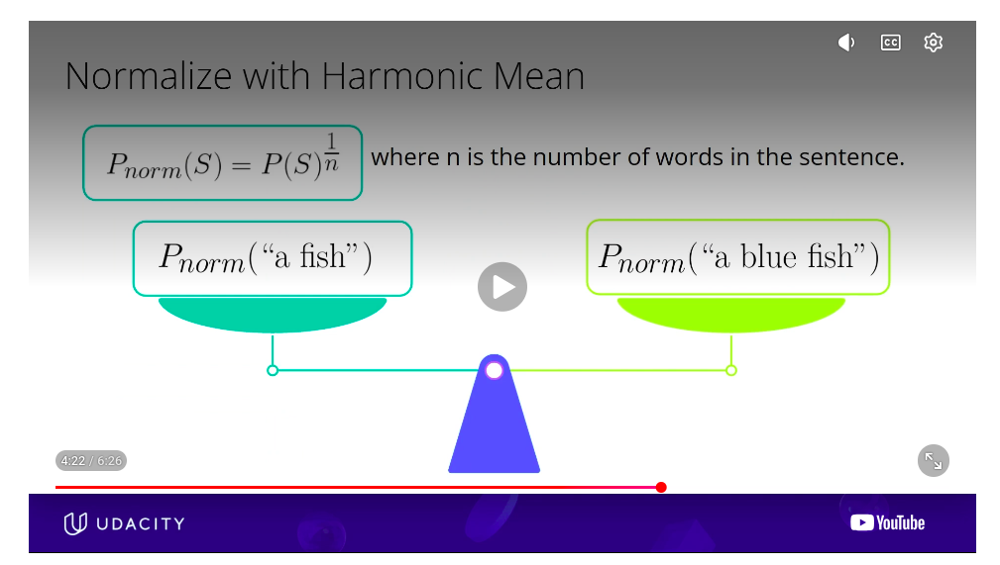
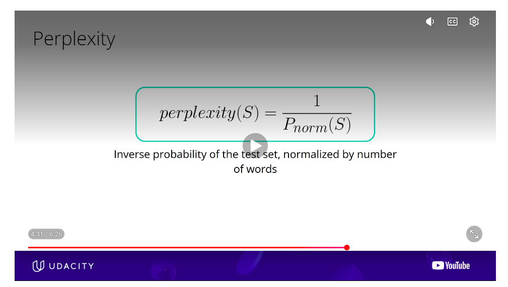
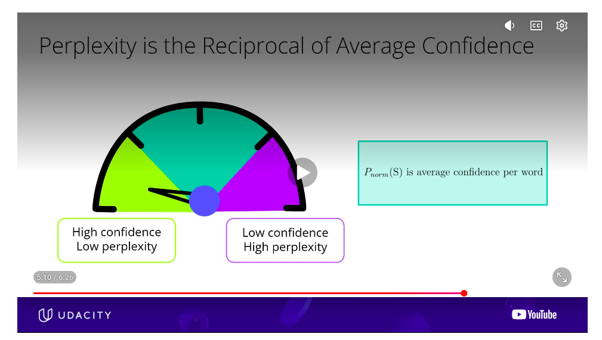

# 🎯 MODEL METRICS: REFERENCES
- a lot of slides from UDACITY's: Model Optimization course
- material from chatgpt
- rest based on my understanding of things

# 🎯 MODEL METRICS:
- Latency 
- Throughput
- Memory Footprint
- Perplexity


 
# 🎯 I & II. LATENCY & THROUGHPUT
### 🔑 HIGH LEVEL TAKEAWAYS
- LATENCY: time taken for a single request (all tokens)
- THROUGHPUT: tokens per second
- BATCH SIZING: Latency, and Throughput are typically competing with each other. This is because of BATCH SIZING
- GPU UTILIZATION: When GPU is underutilized it will result in poorer throughput
- Other Factors affecting Latency and Throughput
  - TOKEN LENGTH/ COUNT: Larger the number of tokens (hence more output tokens) poorer is latency and throughput
  - PRECISION: Lower the precision better the latency and throughput. FP16, INT8 usually the best without compromizing 
  - KV CACHE: Keep KV Cache True for better latency & throughput. KV Cache does consume GPU Memory though
  - 
### 🎯 I.1) LATENCY
 - Latency is how fast a single request completes
 - Question: is latency the time for 1 token or all tokens ?
 - Answer: Latency usually means total response time (all tokens), not just one token. But there are 2 types of latencies
 - i)  End-to-End Latency (What most people mean): Time from sending the prompt → until the full response is received.
 - ii) Time to First Token (TTFT): Time to First Token (TTFT).  Even if total response takes 5 seconds, if TTFT is 200ms, the system feels responsive.( Very important for applications such as chat UX.)

### 🎯 I.2) THROUGHPUT.
- Throughput is how many requests you can handle per unit time. (number of tokens per second)

### 🎯 I.3) BATCH SIZING: Low Latency != High Throughput.
Question:  Does Low Latency mean High Throughput
Answer:  
- If latency is low (time for N tokens is low), you would think Throughput i.e number of tokens per second would also be high. Actually its not. 
- Latency and Throughput are typically competing with each other. Its a trade off. The trade off is BECAUSE of BATCH SIZING. 
 - Low latency often means small batches
 - High throughput often requires larger batches
 - Optimizing one usually worsens the other


💡 Analogy:
```
Think of it like a bus:
Sending 1 passenger immediately → low wait time, poor capacity use
Waiting to fill 40 seats → higher wait, better efficiency
```

** The Catch: Batching Changes Everything **
#### Example A: Low Latency, Low Throughput

If you serve 1 request at a time:
- Batch size = 1
- Very low latency per user
- But GPU is underutilized
- Overall tokens/sec across system is low
👉 Good user experience
👉 Poor hardware efficiency

#### Example B: Higher Latency, Much Higher Throughput

If you batch 32 users together:
- Each user waits slightly longer
- But GPU processes them together
- Tokens/sec across system is much higher
👉 Higher system throughput
👉 Slightly worse latency

### 🎯 I.4.1) LATENCY vs. THROUGHPUT: # of TOKENS(GPU UTILIZATION) 
- Latency: Increasing Tokens increases  (its a linear increases)
- Throughput: Usually decreases with increasing tokens. 
    - But in the exercise1 notebooks, it increases first from 10 to 50 tokens . This means the GPU was likely under utilized at 10 tokensLots of compute cores sit idle → low throughput.

💡 Analogy:
```
Think of the GPU like a factory. Small jobs → workers idle, factory slow. Medium jobs → factory fully running, max output. Very large jobs → workers overloaded, bottlenecks appear, output slows down.

Tokens per request → Throughput
|
|          /\   <- GPU saturation peak
|         /  \
|        /    \
|_______/      \________
```

### 🎯 I.4.2) LATENCY vs. THROUGHPUT: PRECISION fp32, fp16, int8, int4 
Takeaway. 
- Smaller precisions the better for both Latency and Throughput
- FP32 is rarely used
- FP16/ INT8 are both good for Latency and Throughput. INT8 offers higher latency and throughput with a very small dip in accuracy
- INT4 has the highest accuracy and throughput, but accuracy could tank quite a bit (need to be managed carefully).


### 🎯 I.4.3) LATENCY vs. THROUGHPUT:: KV CACHE
What is KV Cache
 - In Transformers each new token attends to all previous tokens
 - When KV Cache is on, the Key and Value Tensors are stored and reuses them. so no need to compute the attention from scratch. 
 - When KV Cache is off , the attention of previous tokens is reused at every step.
 - ADVANTAGE: KV Cache is on, generally both latency and throughput perform better
   - KV cache ON can make decoding 5–20× faster for long sequences.
   - Without KV cache, long-form generation becomes almost unusable.
   - With KV Cache ~O(n²). Without KV Cache ~O(n). See Exercise1_latency_throughput_ksw_solution.ipynb. Without cache the cost per token increases from 9 to 13ms. With kv cache the time per token remains at 5.4ms(although the graph is increasing. notice the scale)
 - DISADVANTAGE: 
   - KV Cache uses GPU Memory i.e precious VRAM (when the model is deployed on GPU memory). When deployed on CPU it uses RAM(which is not such a big deal)
   - KV Cache consumes Batch size×Sequence length×Hidden size. So long contexts + big batches → high memory usage.
   - Hence INT8 / INT4 quantization helps (more room for KV cache), because the weights themselves (and hence model) will use less space
- WHEN IS KV CACHE NOT USED
   - Not used during training
   - Not used when GPU Memory is a constraint (see explanation above)

```
Cost per token
^
|                         *
|                     *
|                 *
|             *
|         *
|     *
| *
+----------------------------------> Sequence length (tokens)

Cost per token
^
|        -------------------------
|
|
|
|
|
+----------------------------------> Sequence length (tokens)

```


# 🎯 III. MEMORY FOOTPRINT

See README_base_vs_peak_memory.md

- MEMORY FOOT PRINT: space metric
- Memory Footprint: how much RAM is needed for MODEL LOAD, & MODEL RUN
- Example 7Billion Parameter model (in FP 16)
  - model weights (LOAD): static memory for model parameters 14GB
  - model activations (RUN): dynamic memory for tensor activations: 5-10GB
  - buffer allocations (RUN): GPU scratch space for CUDA kernels
 
- GPU vs CPU
  - GPU Memory: Lightning Fast but capped at 16-80GB 
  - CPU Memory: Super slow, but much larger
- PEAK MEMORY vs STEADY STATE MEMORY
  - (model weights + activatons + buffer)@Peak_memory (memory at full load )> 
    (model weights + activatons + buffer)@Steady_state_memory (after warmup& settling in)
 



# 🎯 IV. PERPLEXITY
### 🎯IV.1) PERPLEXITY: Quality Metric/ LEVEL of SURPIRSE
 - quality metric for how surprised the model is by new text. (i suppose the loss is higher on new text ??)
 - inverse probability of the test set normalized by the number of words
  

### 🎯IV.2) PERPLEXITY: MATH

```
def compute_perplexity(loss: float):
    return math.exp(loss)
```
- Perplexity is just the exponent of loss, if and only if the loss is the negative log likelihood like cross entropy
- Perplexity actually comes from probability theory . It has been adapted to be used as a model metric. Hence if the loss function is not a log likelihood, there is no defintion of perplexity

| Loss type            | Can you compute perplexity? |
| -------------------- | --------------------------- |
| Cross-entropy / NLL  | ✅ Yes                       |
| Log-likelihood-based | ✅ Yes                       |
| Anything else        | ❌ No                        |

 

This high school math where exponent(log a) = a




### 🎯IV.3) PERPLEXITY: DETAILS

 🎯 Aha Moment: Every Language Model is a Probability Distribution over possible sentences :) 
 - Longer sentence has a lower probability. see pic below
   

- Normalize with harmonic mean. Then compare the sentences
   


- Look at the pic carefully to understand why perplexity is the inverse of probability. Higher the probability, lesser the surpise(lesser perplexity.) which is good

   
   


