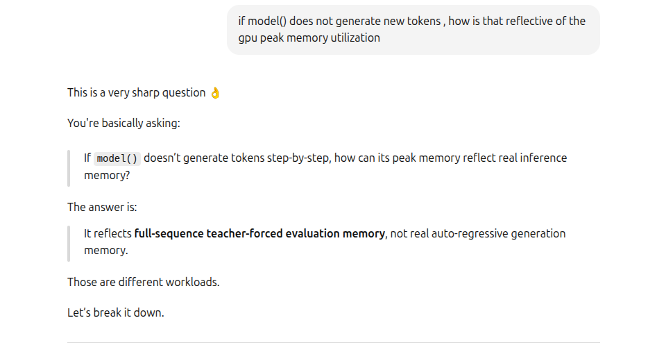
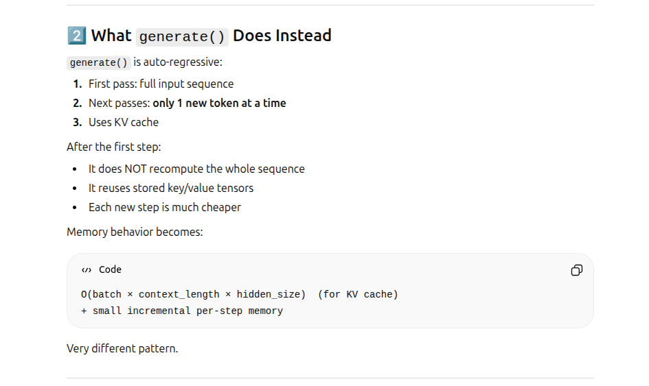
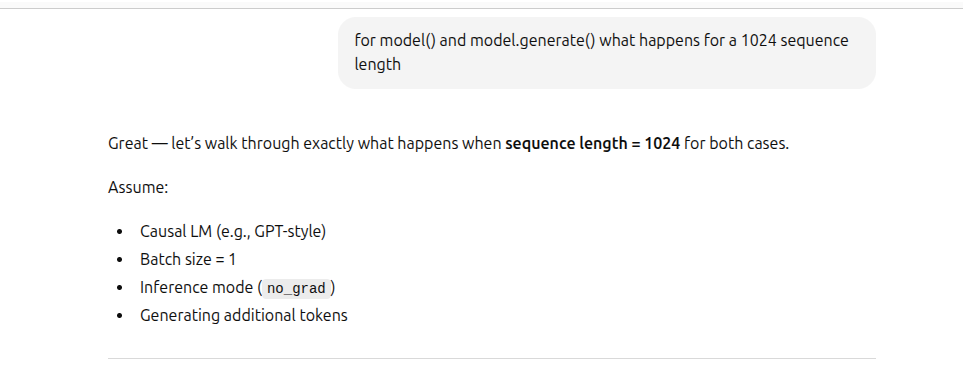
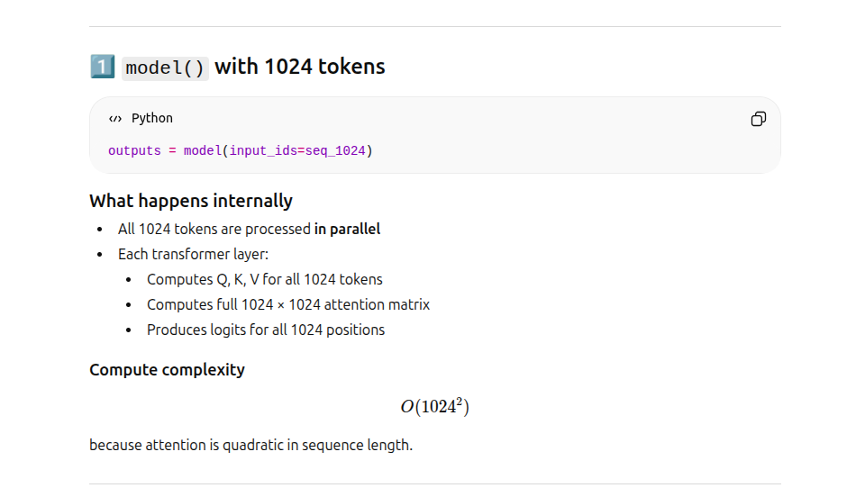
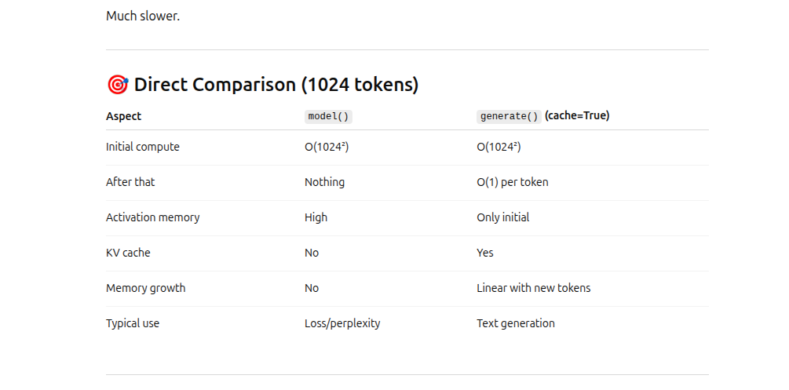

# 🎯 model() vs model.generate() 
in the context of hugging face models and llm text generation
- model(...) = single forward pass (training/eval). does not generate even one token
- model.generate() = auto-regressive text generation loop (multiple forward passes). generates multiple tokens in a loop

# 🎯 1) model(...): single forward pass  + no token prediction
- model DOES NOT generate even one new token
- model does one single forward pass. This gives the logits, which are the probabilities for the next token
- These logits will subsequently have to be processed to predict the next token (but that prediction is not part of a forward pass)
```
# This below line is the only thing model does
outputs = model(input_ids)

# This line below is not part of model()
# You would have to use the output.logits to get the next token
next_token = torch.argmax(outputs.logits[:, -1, :], dim=-1)
```

Example:
- INPUT: "I love machine"
- PROCESSING:
  - model(....) processes the entire 3 word sequence in one go. 
  - it tokenizes every word [I], [love], [machine]. For example the tokens can be 64 dimension vector for each word, so 1x3x64 where 1: batch size, 3: number of tokens, 64: embedding dimension 
- OUTPUT: it predicts the probability distribution for every word. 
  - lets say the vocabulary is 20567 words. 
  - There are 3 probability distributions 1 each for I, love, machine. The pd for each is spread over 20567 words
  - Output is 1x3x20567
  - NOTICE THAT NO WORD/TOKEN IS PREDICTED

| Position | Context Seen     | OUTPUT: Prediction Distribution |
| -------- | ---------------- | ------------------------------- |
| 1        | `I`              | probabilities for next token    |
| 2        | `I love`         | probabilities for next token    |
| 3        | `I love machine` | probabilities for next token    |

What the ouput might look like. 
- where [love, like, am, machine, pizza, you, learning, tools, models....] are all part of the 20567 vocabulary
- you would have to process these logits to get the next token
```
Position 1 (after "I")
love: 0.60
like: 0.20
am: 0.10
...

Position 2 (after "I love")
machine: 0.55
pizza: 0.15
you: 0.05
...

Position 3 (after "I love machine")
learning: 0.80
tools: 0.05
models: 0.03
...
```

🎯 NOTE: predict logits for all tokens . parallely 
```
Predict after I       → logits[:, 0, :]
Predict after I love  → logits[:, 1, :]
Predict after I love machine → logits[:, 2, :]
```
- The task is to predict the next one output token only. 
- Hence only the logits /probability of the last input token is needed
- But model() predicts logits for all input tokens (even though only the last is seen)
  - 🎯 KEY AHA MOMENT !!!!
- This is because of the clever architecture of transformers, which enables parallel processing of input tokens . 
- This is a key differentiator from previous RNNs and LSTMs
- Each token attends to all previous tokens simultaneously. (what does this mean)
  - I attends to I
  - at the same time . Love attends to "I love"
  - at the same time . Machine attends to "I love machine" 
  - This simultaneous attending to is because of self attention/causal attention


# 🎯 2) model.generate(): multiple forward pass + multiple token/text generation
     - auto-regressive text generation loop (multiple forward passes)
     - that means multiple forward passes and multiple tokens are generated
     - in a loop: forward pass, use output logits/probability to get next token, append next token to input and repeat to generate new tokens. (model.generate() does much more actually)

```
predict token
append token
predict next token
append token
repeat...
```


Very Simplified Mental Model Code
```
for step in range(max_new_tokens):
    outputs = model(input_ids, past_key_values=cache)
    logits = outputs.logits[:, -1, :]
    probs = softmax(logits)
    next_token = sample_or_argmax(probs)
    input_ids = append(input_ids, next_token)
    update_cache()
```


| Feature                        | `model(...)`            | `model.generate()`  |
| ------------------------------ | ----------------------  | ------------------  |
| Forward passes                 | 1                       | Many                |
| Used for training              | ✅                      | ❌                  |
| Returns loss                   | ✅ (if labels provided) | ❌                  |
| Returns logits                 | ✅                      | ❌ (by default)     |
| Generates new tokens           | ❌                      | ✅                  |
| Used for inference text output | ❌                      | ✅                  |


# 🎯 3) INSIGHTS
## 🎯 3.1 How is model() reflective of GPU performance if it does not generate new tokens

 

### 3.1.1 🧠 Important Insight
- If you're only evaluating a 1024-token batch:
  - memory consumed during model() ≈ memory consumed in first step of generate()
- If you're generating beyond 1024:
  - memory consumed during generate()  > memory consumed during model() (because of KV accumulation)

## 🎯 3.2 model() vs model.generate()
### 3.2.1 what model() does
   

### 3.2.2 what model.generate() does
   

## 🎯 3.3 model() vs model.generate(): with 1024 sequence
   

### 3.3.1 what model() does : with 1024 sequence
   
   

### 3.3.2 what model.generate() does : with 1024 sequence (with KV Cache True )
   
   
### 3.3.3 what model.generate() does : with 1024 sequence (with KV Cache False )
    | Position | Context Seen     | OUTPUT: Prediction Distribution      |


## 🎯 3.4 model() vs model.generate() : 1024 sequence comparison table
  


## 🎯 3.5 model() vs model.generate(): inputs

### 🎯 3.5.1 model() : What is the input ?
Question: What is the input. Is it model(**inputs), or model(input_ids)
Answer:
✅ Rule of thumb
- Training / computing loss: usually need labels and possibly attention_mask. best to use model(**inputs)
- Evaluation / forward only (torch.no_grad()): often input_ids alone is enough. fine to use model(input_ids)
- Batched inputs with padding: include attention_mask. best to use model(**inputs). where inputs should have the attention_mask as a dict field. rest of the fields can be missing

```
outputs = model(**inputs)    # Best, robust. definitely needed for training. 
outputs = model(input_ids)   # Enough for inference . Enough when using with.torch.no_grad()
```

**Details**
- Typically model(**inputs): where inputs is a dictionary of tensors with the following fields. The entire dictionary of **inputs is typically used for in the forward pass for training
- Depending on the use case and the model, the missing fields like attention masks could be inferered from the input_ids

**REQUIRED FIELD: input_ids**
| Field       | Type               | Purpose                                                          |
| ----------- | ------------------ | ---------------------------------------------------------------- |
| `input_ids` | `torch.LongTensor` | Token IDs representing your text. Shape: `(batch_size, seq_len)` |

**COMMON OPTIONAL FIELDS:**
| Field                  | Type                | Purpose                                                                       |
| ---------------------- | ------------------- | ----------------------------------------------------------------------------- |
| `attention_mask`       | `torch.LongTensor`  | 1 = keep token, 0 = ignore (used for padding). Shape: `(batch_size, seq_len)` |
| `position_ids`         | `torch.LongTensor`  | Overrides default positional embeddings                                       |
| `inputs_embeds`        | `torch.FloatTensor` | Instead of `input_ids`, you can pass precomputed embeddings                   |
| `labels`               | `torch.LongTensor`  | For training: target labels for computing loss                                |

- if model is used for inference in with.torch.no_grad() mode then input_ids is sufficient. in that case model(input_ids)

### 🎯 3.5.2 model() : Deploy inputs or input_ids to device. Use that as input

**Deploying inputs to device. Use that as input to model**
```
# inputs is a dictionary. Below line will not work. You would have to deploy tensor by tensor
inputs.to(model.device)
outputs = model(**inputs)
```

Do this instead

```
inputs_on_device = {k: v.to(model.device) for k, v in inputs.items()}
_ = model(**inputs_on_device)
```

**Deploy input_ids to device. Use input_ids as input to model**
```
input_ids = input_ids.to(model.device)
outputs = model(input_ids)
```

### 🎯 3.5.6 model.generate() : Deploy input_ids to device. Use that as input

```
input_ids = input_ids.to(model.device)
outputs = model.generate(input_ids=input_ids, max_new_tokens=50)
```


## 🎯 3.6 model() vs model.generate(): which to use

### 🎯 3.6.1  model() vs model.generate(): WARMUP - which to use
- warmup should use whatever the main programme is going to use (LOL , what a deadend answer 😂)
- 🎯 METRICS WARMUP: use whatever the metrics measurement code is going to use
- 🎯 PROFILING WARMUP : (Example: where you generate prof.key_averages() using pytorch profiler). Yes this process requires profiling too 😅. Use whatever the profiling code will use
- lets say your main programme is going to run model.generate(), and during the warmup you run model() a few times. These two are not equivalent. see code below
```
# The following two are not equivalent even though num_warmup = 10 & max_new_tokens = 10

# Warmup
num_warmup = 10
with torch.no_grad():
    for _ in range(num_warmup):
        _ = model(**inputs)


# Warmup
max_new_tokens = 10
with torch.no_grad():
    _ = model.generate(**inputs, max_new_tokens=max_new_tokens, pad_token_id=tokenizer.eos_token_id)

```
- model() only warms up the forward pass several times ( recall it does not generate a token even once !)
- model.generate(): there is much more going on in a model generate loop. It generates new tokens

### 🎯 3.6.2  model() vs model.generate(): METRICS - which to use
- 🎯 FOR LLMs we like to measure latency, throughput, memory and perplexity. It best to run model.generate(), except for perplexity . Recall that perplexity is the exponent of loss. model.generate() does not return loss, only model() does. Thats a fundamental reason why perplexity uses model() (there are other reasons too. ask AI 😅 )
  - ✅   see lesson1_intro_to_model_optimization/T1_latency_throughput demo1_example1_latency_throughput_ksw_solution.ipynb : uses model.generate() for latency & throughput
  - ✅   see lesson1_intro_to_model_optimization/T1_latency_throughput demo1_example1_latency_throughput_ksw_solution.ipynb : uses model.generate() for latency & throughput
```
Latency      -> model.generate()
Throughput   -> model.generate()
Memory       -> depends, but for inference generation use model.generate()
Perplexity   -> model(..., labels=...)
```

- 🎯 If you are getting metrics for a forward pass, you could use model() for everything
  -  ✅   see lesson1_intro_to_model_optimization/T2_memory_perplexity/demo2_memory_perplexity_ksw.ipynb : uses model() for all including perplexity
  -  ✅   see lesson1_intro_to_model_optimization/T2_memory_perplexity/exercise2_memory_perplexity_ksw_solution.ipynb : uses model() for all including perplexity
```
Latency      -> model()
Throughput   -> model()
Memory       -> model()
Perplexity   -> model(..., labels=...)
```

- 🎯 For profiling: example getting the prof.key_averages() table using pytorch profiler
  - ✅ for inference performance: use model.generate()
  - ✅ training/perplexity: use model()

- 🎯 If you are dealing with a vision transformer model and want to get metrics or profile things, it probably makes sense to use model() for all
