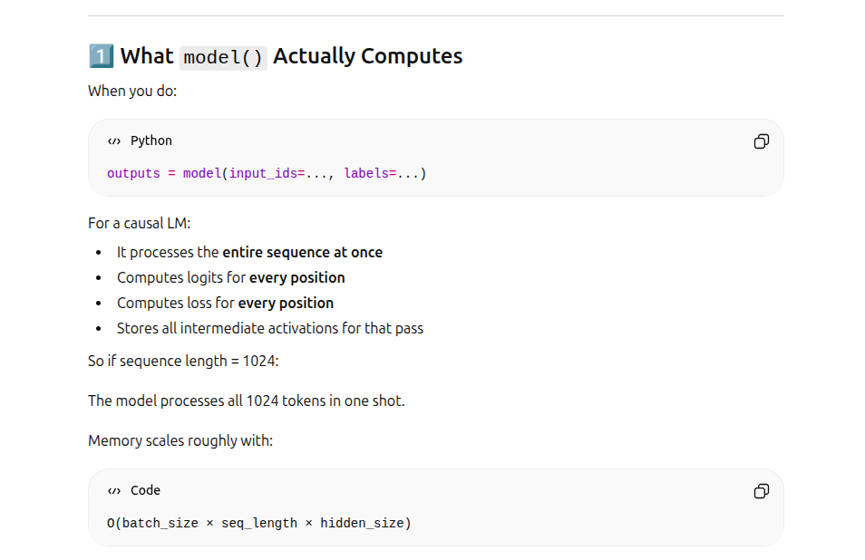
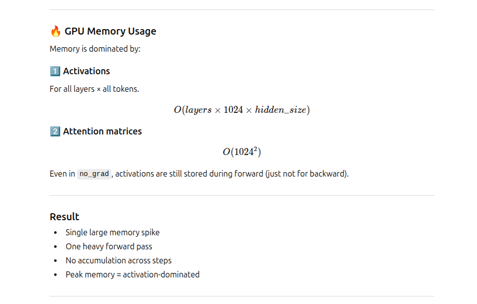
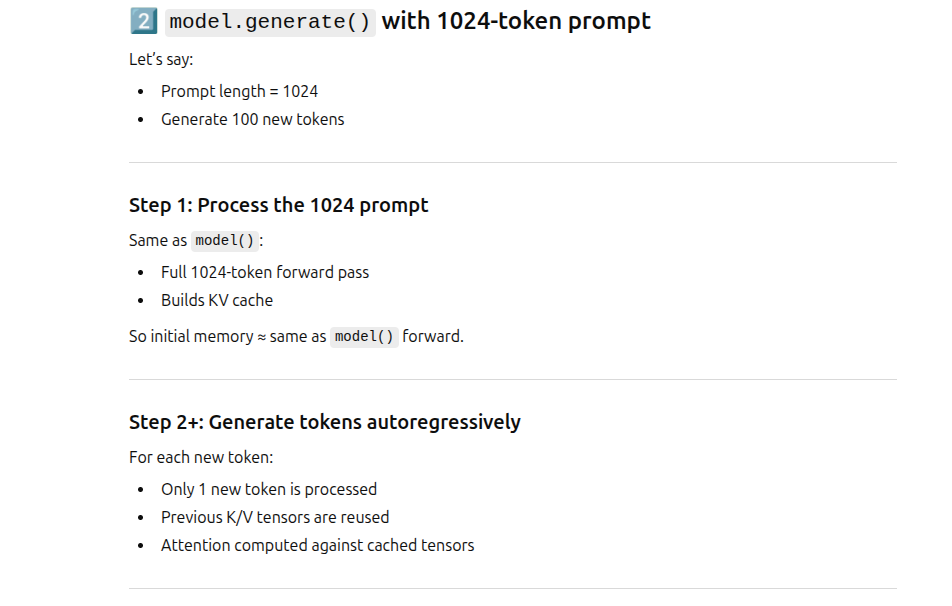
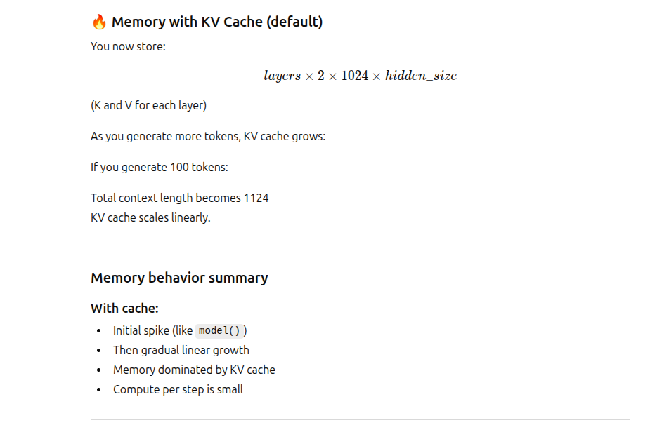
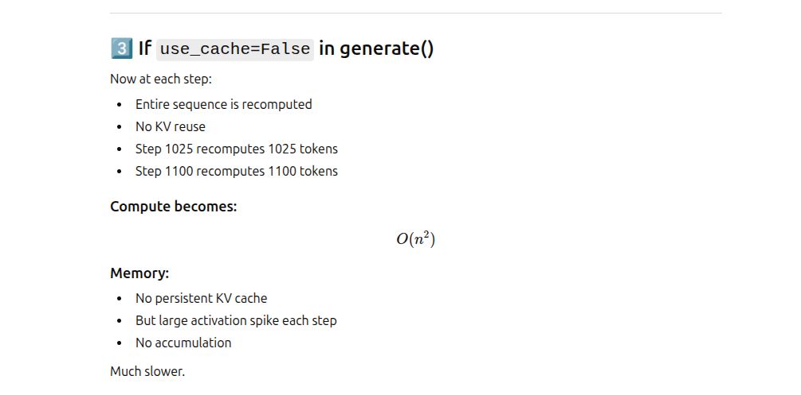

# Memory & Perplexity

### 🎯 1. model() vs model.generate() 
in the context of hugging face models and llm text generation
model(...) = single forward pass (training/eval)
model.generate() = auto-regressive text generation loop (multiple forward passes)

| Feature                        | `model(...)`            | `model.generate()`  |
| ------------------------------ | ----------------------  | ------------------  |
| Forward passes                 | 1                       | Many                |
| Returns loss                   | ✅ (if labels provided) | ❌                  |
| Returns logits                 | ✅                      | ❌ (by default)     |
| Generates new tokens           | ❌                      | ✅                  |
| Used for training              | ✅                      | ❌                  |
| Used for inference text output | ❌                      | ✅                  |

## 🎯 1.1 How is model() reflective of GPU performance if it does not generate new tokens

 

### 1.1.1 🧠 Important Insight
- If you're only evaluating a 1024-token batch:
  - model() memory ≈ first step of generate()
- If you're generating beyond 1024:
  - generate() memory > model() (because of KV accumulation)

## 🎯 1.2 model() vs model.generate()
### 1.2.1 what model() does
   

### 1.2.2 what model.generate() does
   

## 🎯 1.3 model() vs model.generate(): with 1024 sequence
   

### 1.3.1 what model() does : with 1024 sequence
   
   

### 1.3.2 what model.generate() does : with 1024 sequence (with KV Cache True )
   
   
### 1.3.3 what model.generate() does : with 1024 sequence (with KV Cache False )
  

## 🎯 1.4 model() vs model.generate() : 1024 sequence comparison
  