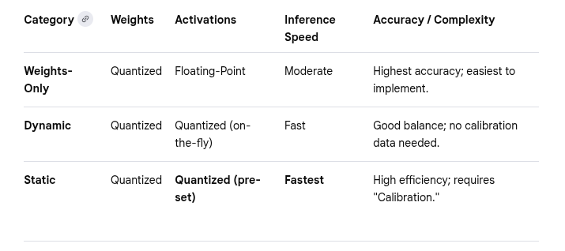

# 🎯 C1, L2, T1 & T3: POST TRAINING QUANTIZATION
There are 3 types of quantizations
1) Weight only INT8 Quantization: 
   - Weights quantized to INT8 and stored (offline)   
   - No activation parameters
   - Activations remain FP32. Activations computed on the fly (runtime, nothing stored)
   - no calibration required , since activations dont participate in quantization

2) Dynamic Quantization: 
   - Weights quantized to INT8 and stored (offline)
   - Activation parameters computed on the fly from the current tensor. Not precomputed, not stored (runtime) 
   - Activations quantized to INT8 on the fly using the activation parameters above.  (runtime)
   - no calibration required , since activation parameters are calculated at runtime

3) Full Static Quantization
    - Weights quantized to INT8 and stored (offline)
    - Activation parameters (scaling factor etc) are precomputed and stored. (offline)
    - Activations quantized to INT8 on the fly(but using precomputed activation parameters) (runtime)
    - calibration required to precomputer activation parameters
    



NOTe: When a model is converted from FP32 to FP16 , is that quantization ?
Answer: No. See ☀️ DETAILS D4 : FP32 to FP16
## 🎯 CODE 
- see lesson2_quantization_techniques/T1_ptq/demo1_post_training_quantization_ksw.ipynb


## 🎯 0. BASELINE MODEL
- WEIGHTS: FP32 
- ACTIVATION PARAMETERS: None 
- ACTIVATIONS: remain FP32 . THEY ARE NOT QUANTIZED in the baseline model . 
- 🙂 CALIBRATION & COMPLEXITY: 
  - No quantization, hence no calibration. 
  - Easiest to implement of the 3 
- 🙂 STORAGE MEMORY: 
  - weights : FP32 (highest memory) 
  - activations : FP32 , calculated at runtime . 
- 😟 RUNTIME MATMUL : ~= Weights_FP32*Activation_FP32: 
- 🙂 RUNTIME INFERENCE : MEMORY, SPEED, ACCURACY  
  - 😟 RUNTIME INFERENCE MEMORY:  Highest (See DETAILS D2 : RUNTIME INFERENCE MEMORY chart below)
  - 😟 RUNTIME INFERENCE SPEED: Lowest of the 3, activations are FP32 , matmul happens in FP32
  - 🙂 RUNTIME INFERENCE ACCURACY: Highest of the 3, activations are FP32 , matmul happens in FP32

\
\

## 🎯 1. WEIGHTS ONLY INT8 QUANTIZATION

- WEIGHTS: parameter weights are quantized offline to INT8
- ACTIVATION PARAMETERS: None 
- ACTIVATIONS: DO NOT get quantized . Activations remain FP32 . THEY ARE NOT QUANTIZED EVEN AT RUN TIME .
- 🙂 CALIBRATION & COMPLEXITY: 
  - Since activations are not being quantized, no calibration is needed. 
  - No Calibration: hence pretty stable, pretty Easy to Implement
- 🙂 STORAGE MEMORY: 
  - weights have gone from FP32 to INT8. Memory goes down by 4 times. 
  - activations are not quantized. They are FP32. No savings in memory there. 
  - Even IF ACTIVATIONS ARE QUANTIZED , THEY ARE NOT STORED. THEY DO NOT AFFECT STORED MODEL SIZE (see DETAILS D1 : STORAGE MEMORY ON DISK chart below ) 
  - but despite the activations in FP32, weights are the bulk of any model size. Significant model storage savings nevertheless
- 😟 RUNTIME MATMUL: ~= (Weights_INT8* Scale)*Activation_FP32
    - During Runtime the weights are INT8, the activations are FP32. But Matmul happens in FP32. So the weights need to be scaled. 
    - This matmul is not as efficient as when both the weights and activations are INT8, But it is still better than Weights and Activation are both in FP32
- 🙂 RUNTIME INFERENCE : MEMORY, SPEED, ACCURACY  
  - 😟 RUNTIME INFERENCE MEMORY:  Highest Requirement of the 3. (See DETAILS D2 : RUNTIME INFERENCE MEMORY chart below)
  - 😟 RUNTIME INFERENCE SPEED: Lowest of the 3, since activations are FP32 and matmul is done in FP32
  - 🙂 RUNTIME INFERENCE ACCURACY: Highest of the 3, since activations are FP32 and matmul happens in FP32

\
\

## 🎯 2. DYNAMIC INT8 QUANTIZATION
- WEIGHTS: parameter weights are quantized and stored offline to INT8
- ACTIVATION PARAMETERS: Scaling parameters are not precomputed . Hence not stored offline in INT8. They are computed on the fly, at runtime to INT8, from the current activation tensors.
- ACTIVATIONS: : 
  - During runtime, activations temporarily quantized from FP32 to INT8 before MATMUL.
  - Activation tensors are temporary runtime tensors
  - Some activation tensors could remain in FP32 
- 🙂 CALIBRATION & COMPLEXITY: 
  - No calibration needed since activation parameters are not precomputed 
  - No Calibration: relatively stable and fairly easy to implement compared to full static quantization
- 🙂 STORAGE MEMORY:
  - weights have gone from FP32 to INT8. Memory goes down by 4 times
  - activation parameters not stored on disk. (dynamically calculated)
  - activations are NOT stored on disk, so activation quantization does not affect stored model size
  - Stored model size is therefore very similar to Weights-Only INT8 quantization (see DETAILS D1 : STORAGE MEMORY ON DISK chart below)
- 🙂 RUNTIME MATMUL: ~= Weight_INT8 * Activation_INT8
  - During runtime, activations are temporarily quantized to INT8 before matmul
  - This is more efficient than Weights-Only INT8 because both operands can participate in INT8 computation
- 🙂 RUNTIME INFERENCE : MEMORY, SPEED, ACCURACY
- 🙂 RUNTIME INFERENCE MEMORY:
  - Lower than Weights-Only INT8: because activations are also INT8
  - Higher than Full/Static INT8: because some intermediary activations could still remain in FP32
- 🙂 RUNTIME INFERENCE SPEED:
  - Faster than Weights-Only INT8: Since INT8 matmul is used, inference is more efficient. But some time is lost to overheads like activation parameter calculation
  - Slower than Full/Static INT8: because some activations could remain in FP32
- 🙂 RUNTIME INFERENCE ACCURACY:
  - Usually slightly lower than Weights-Only INT8
  - Usually better than Full/Static INT8. because matlmul is fully in INT8 for full static quantization. INT8 reduces accuracy

\
\

## 🎯 3. FULL STATIC INT8 QUANTIZATION
- WEIGHTS: parameter weights are quantized and stored offline to INT8
- ACTIVATIONS PARAMETERS:
  - Scaling parameters ARE precomputed during calibration and stored offline with the quantized model
  - These parameters are determined using representative calibration data
  - hence activation parameter computation, during runtime,  is NOT needed
- ACTIVATIONS:
  - During runtime, activations are quantized from FP32 to INT8 using the precomputed activation parameters before MATMUL
  - Activations remain temporary runtime tensors
  - Activations are more consistently in INT8 ( compared to Dynamic INT8 quantization where some could remain FP32) 
- 🙂 CALIBRATION & COMPLEXITY: 
  - needed since activation parameters are precomputed 
  - need representative calibration data . 
- 🙂 STORAGE MEMORY:
  - weights gone from FP32 to INT8. Memory goes down by 4 times
  - activation parameters are INT8 . They are stored on disk. But this over head is very small
  - activations are NOT stored on disk (They NEVER ARE for any quantization)
  - hence stored model size is therefore only marginally more than Weights-Only INT8 quantization , or Dynamic Quantization (see DETAILS D1 : STORAGE MEMORY ON DISK chart below)
- 🙂 RUNTIME MATMUL: ~= Weight_INT8 * Activation_INT8
  - During runtime, activations are temporarily quantized to INT8 before matmul
  - This is more efficient than Weights-Only INT8 because both operands can participate in INT8 computation
- 🙂 RUNTIME INFERENCE : MEMORY, SPEED, ACCURACY
- 🙂 RUNTIME INFERENCE MEMORY: lowest since everything is INT8
- 🙂 RUNTIME INFERENCE SPEED: highest since everything is INT8
- 🙂 RUNTIME INFERENCE ACCURACY:
  - lowest since everything is INT8. INT8 tanks accuracy
  - Accuracy depends heavily on calibration quality and model architecture

\
\

##  ☀️ DETAILS
## ☀️ DETAILS D1 : MODEL STORAGE MEMORY 
- From the below notice that all 3 models when stored in CPU/HARD DISK. They virtually have the same foot print
- Hence they would have the same footprint when loading onto the VRAM (GPU) as well
- Therefore at this point the method of quantization, whether it is for a high accuracy application, or low memory application such as edge device , a lot of it is determined by the  i) Model Run Time (Inference) Performance ii) Ease of Quantization (and not on Model Storage Memory)

```
--------------------------------------------------------
Storage Memory (Model on Disk)
--------------------------------------------------------

0. Baseline FP32 (No Quantization)
Weights      : 🟩🟩🟩🟩🟩🟩🟩🟩🟩🟩🟩🟩🟩🟩🟩🟩  2 GB
Activations  : 🟨🟨🟨🟨🟨🟨🟨🟨🟨🟨🟨🟨🟨🟨🟨🟨  2 GB (not stored)
Total        : 🟦🟦🟦🟦🟦🟦🟦🟦🟦🟦🟦🟦🟦🟦🟦🟦 ≈ 2 GB stored (activations not stored)

1. Weight-only INT8
Weights      : 🟩🟩🟩🟩  0.5 GB
Activations  : 🟨        (not stored)
Total        : 🟦🟦🟦🟦  ≈ 0.5 GB stored (activations not stored)


2. Dynamic INT8
Weights      : 🟩🟩🟩🟩  0.5 GB
Activations  : 🟨        (not stored)  
Total        : 🟦🟦🟦🟦  ≈ 0.5 GB stored (activations not stored)

3. Full/Static INT8
Weights      : 🟩🟩🟩🟩  0.5 GB
Activations  : 🟨        (not stored)  
Total        : 🟦🟦🟦🟦  ≈ 0.5 GB stored (activations not stored)
```

\
\

## ☀️ DETAILS D2 : MODEL RUNTIME INFERENCE MEMORY 
Runtime Inference Memory , Speed and Accuracy is one of the biggest drivers for model quantization choice
-  High Accuracy, but lower speed and  higher inference memory okay: Use Weights Only Quantization
-  High Speed is absolute requirement: Use Full Static Quantization (But need to go through the pain of getting an accurate calibration dataset)
- Somewhere in between but dont want to calibrate and stuff : Use Dynamic Quantization
```
--------------------------------------------------------
Memory Usage During Inference (Runtime)
--------------------------------------------------------

0. Baseline FP32 (No Quantization)
Weights      : 🟩🟩🟩🟩🟩🟩🟩🟩🟩🟩🟩🟩🟩🟩🟩🟩  2 GB
Activations  : 🟨🟨🟨🟨🟨🟨🟨🟨🟨🟨🟨🟨🟨🟨🟨🟨  2 GB
Total        : 🟦🟦🟦🟦🟦🟦🟦🟦🟦🟦🟦🟦🟦🟦🟦🟦🟦🟦🟦🟦🟦🟦🟦🟦🟦🟦🟦🟦🟦🟦🟦🟦 ≈ 4 GB

1. Weight-only INT8
Weights      : 🟩🟩🟩🟩  0.5 GB
Activations  : 🟨🟨🟨🟨🟨🟨🟨🟨🟨🟨🟨🟨🟨🟨🟨🟨  2 GB
Total        : 🟦🟦🟦🟦🟦🟦🟦🟦🟦🟦🟦🟦🟦🟦🟦🟦🟦🟦🟦🟦 ≈ 2.5 GB

2. Dynamic INT8
Weights      : 🟩🟩🟩🟩  0.5 GB
Activations  : 🟨🟨🟨🟨🟨🟨🟨🟨  ~1.0 GB
Total        : 🟦🟦🟦🟦🟦🟦🟦🟦🟦🟦🟦🟦  ≈ 1.5 GB
Note: Activations quantized on-the-fly; some FP32 intermediates may exist.

3. Full/Static INT8
Weights      : 🟩🟩🟩🟩  0.5 GB
Activations  : 🟨🟨🟨🟨  0.5 GB
Total        : 🟦🟦🟦🟦🟦🟦🟦🟦  ≈ 1.0 GB
Note: Activations fully INT8 → maximum runtime memory reduction.
```

\
\

## ☀️ DETAILS D3 : QUANT & DEQUANT INSERTION
- DEQUANT inserted where necessary
  - In the Matmul Weights_INT8 are scaled to make it floating point. Conversion of INT to Floating Point is called DEquantization. This is the layer that is inserted on the fly between the weights and activation to be able to do multiplication in FP32. 
    ```
        FP32 activation x
            │
            ▼
        DeQuant layer: W_int8 → W_fp32
            │
            ▼
        MatMul (FP32): x_fp32 @ W_fp32
            │
            ▼
        FP32 output activation
    ```
- QUANT inserted where necessary
    - Sometimes a Floating point needs to be converted to INT. This is called Quantization (lol thats what we are studying too !) The layer that does it is called QUANT LAYER. 
    - Example: In a model where both the weights and activations are quantized. You might need to convert the output from  could be converting the final output from INT8 to floating point. This will need a Quant Layer
- NOT EVERYTHING CAN RUN INT8
  - Realistically not everything can run in INT8, some run on FP16/FP32. In this case Quant and DeQuant are inserted accordingly
  ```
    | Operation       | Usually INT8?   |
    | --------------- | --------------- |
    | Matrix multiply | Yes             |
    | LayerNorm       | Often FP16/FP32 |
    | Softmax         | FP16/FP32       |
    | GELU            | FP16/FP32       |

  ```
  
## ☀️ DETAILS D4 : FP32 to FP16: (Precision Reduction. NOT Quantization)
- Only conversion to INT formats INT8, INT4 would count as quantization
- FP16 is still floating point format. Hence this is not Quantization
  - No scale factors are introduced.
  - No zero-points are introduced.
  - The model still performs floating-point arithmetic.
- FP32 to FP16 is conversion is PRECISION REDUCTION

```
# Rule of Thumb
FP32 → FP16 = precision reduction
FP32 → INT8/INT4 = quantization
```

```
# FP16 is still floating point format. HAs eponent and mantissa

| Format | Sign | Exponent | Mantissa |
| ------ | ---- | -------- | -------- |
| FP32   | 1    | 8        | 23       |
| FP16   | 1    | 5        | 10       |
```

```
| Conversion   | Common Name               | Quantization?  |
| ------------ | ------------------------- | -------------- |
| FP32 → FP16  | Half-precision conversion | Usually **No** |
| FP32 → BF16  | BFloat16 conversion       | Usually **No** |
| FP32 → INT8  | Integer quantization      | **Yes**        |
| FP32 → INT4  | Integer quantization      | **Yes**        |
| FP32 → UINT8 | Integer quantization      | **Yes**        |

```
