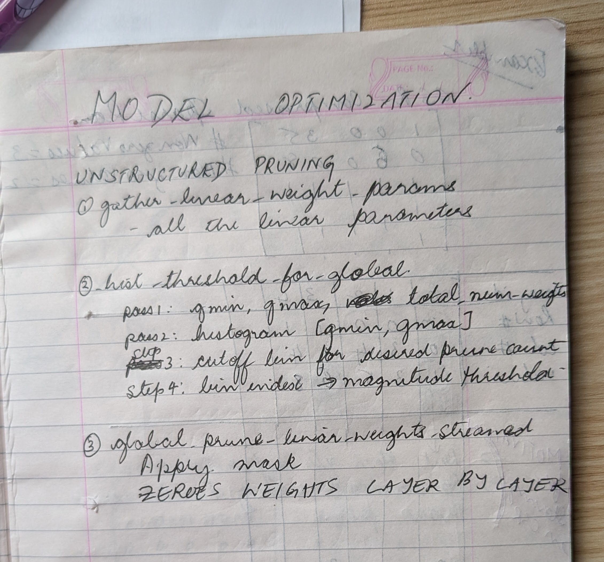
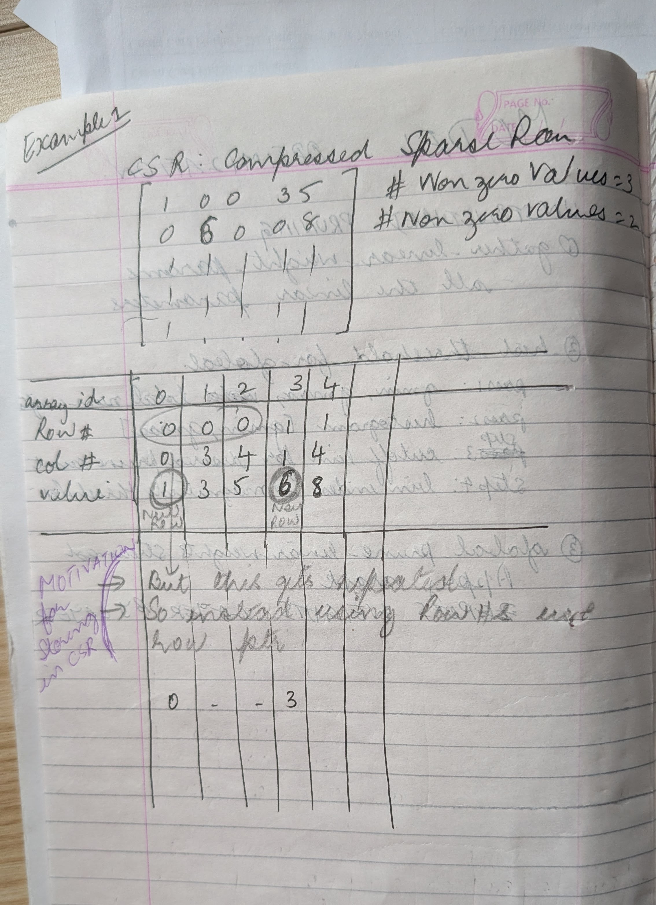
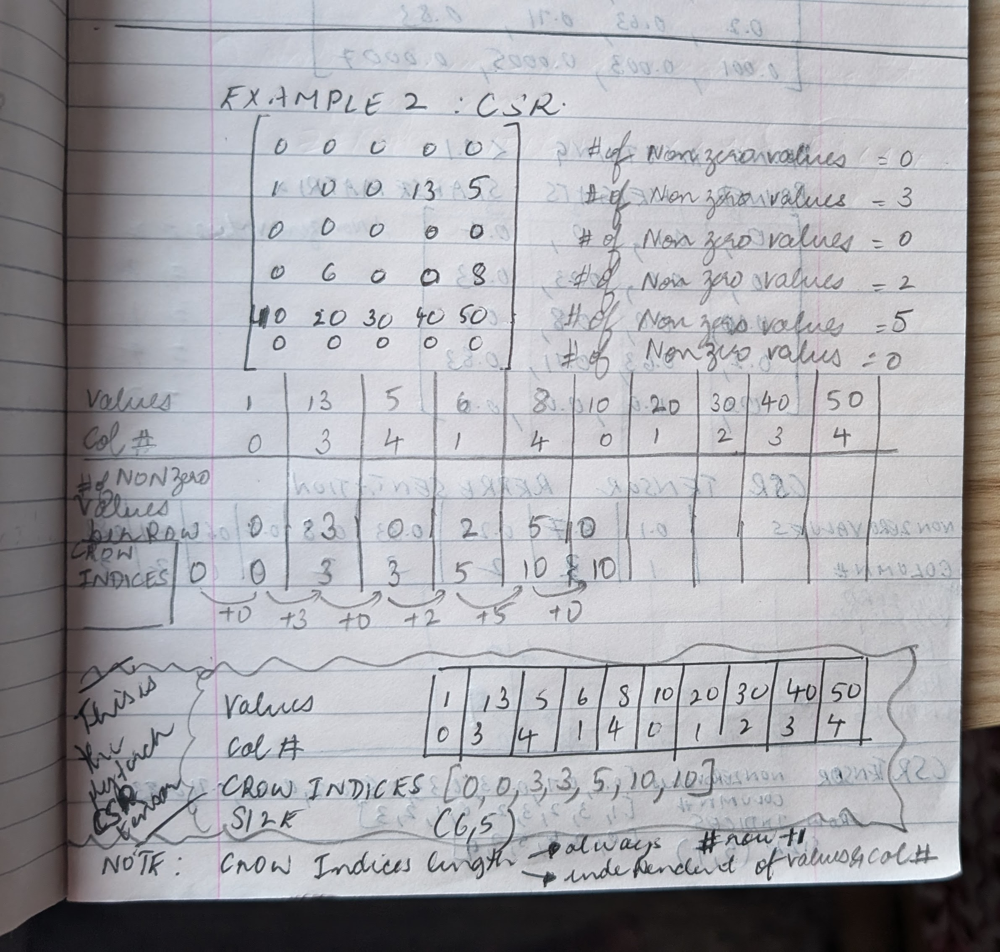
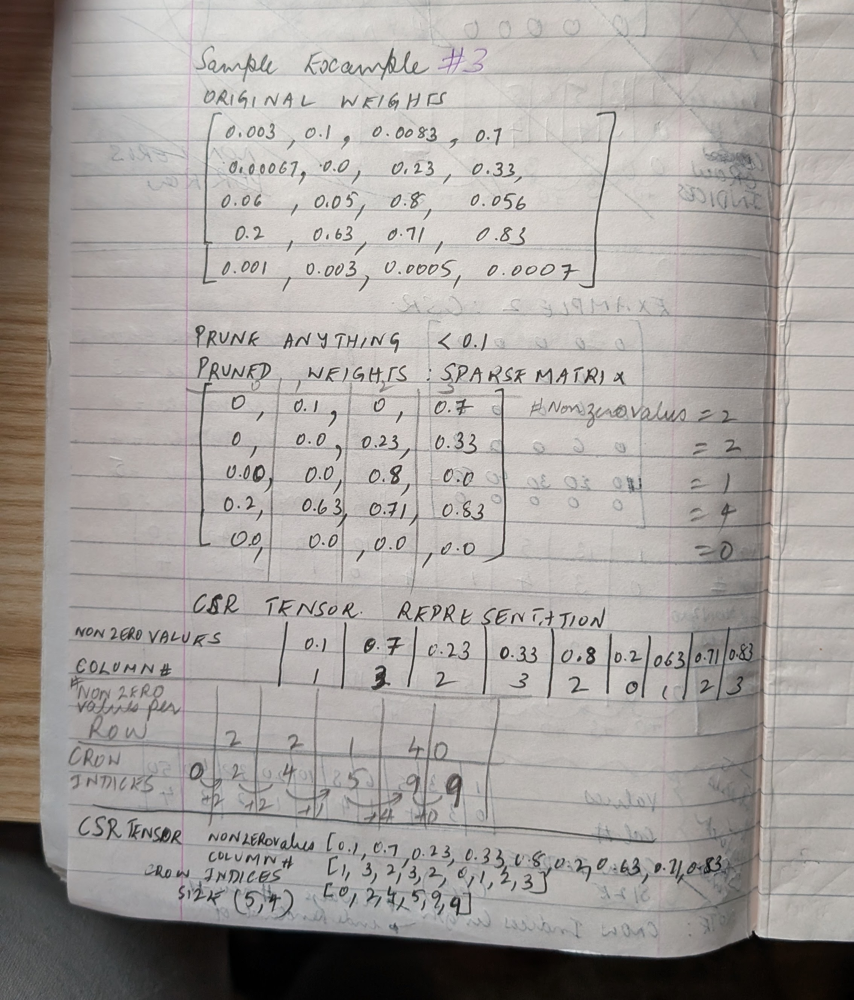

# Unstructured Pruning 
## 1) HIGH LEVEL ALGO: Key Ideas
- Remove all the weights below a certain percentile. i.e remove the lowest 20 % of the weights
- HISTOGRAM for UNSTRUCTURED PRUNING : instead of getting one large tensor with all the weight and then sorting through it to get the lowest 20%. Build a histogram. This is a great technique
- Storing the pruned model:CSR compressed sparse row (CSR format is for storing only, not for inference)

PROS/CONS
- Unsturcutured pruning might not give significant inference speed ups , because the sparse weights are scattered everywhere. its not like entire layers/ neurons have been pruned

 

## 2) 🎯 Why Histogram Instead of Flattening
Flattening is the naive method
```
all_weights = torch.cat([W.flatten() for W in layers])
threshold = torch.quantile(all_weights.abs(), 0.2)
```

- For Large LLMs: 7B weights × 4 bytes = 28GB. You cannot allocate a 28GB vector
-  Instead you iterate layer by layer and build a histogram with 2048 bins. 2048 bins would take up ~16 KB. HUGE MEMORY SAVINGS 

## 3) STORING THE PRUNED MODEL: CSR TENSOR COMPRESSED SPARSE ROW)
- Original Weights: non sparse
- Pruned Weights: some percentage of values are made zero in the original weights. Hence this is a Sparse Matrix
- CSR Tensor: The Sparse matrix is converted to a tensor (there is an algorithm for this)
  NOTE: Only Linear Weights are Pruned and then converted to CSR. The Relu and other layers are as is99
- CSR is simply for storing the weights. If you need to run inference with the Pruned weights, you'd still have to convert back to sparse matrix
- This is because nn.Linear still expects the weights in the original format
- SPARSE INFERENCE: If CSR Tensors need to be used (instead of the pruned sparse matrix), the following things will be needed
    - custom kernels
    - torch.sparse.mm
    - Triton kernels
    - libraries like SparseGPT / DeepSparse

### 3.1) CSR: Compressed Sparse Row: Algorithm

### 3.1.1) CSR : Motivation to Store in this format
 

### 3.1.2) CSR : Algorithm and Examples
 

