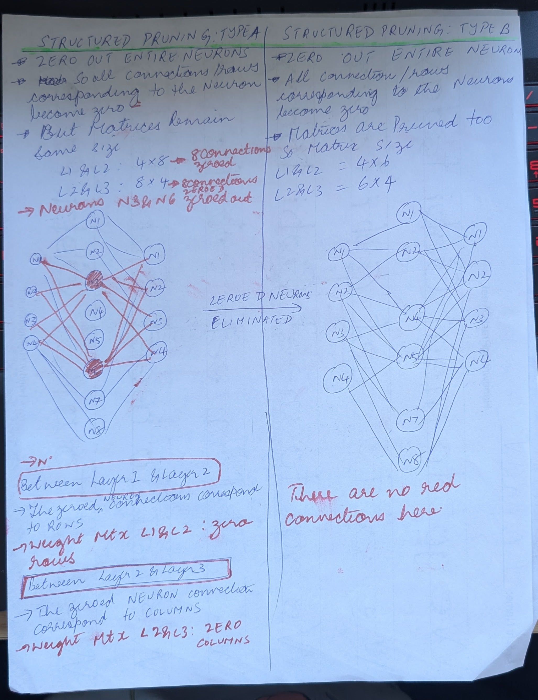
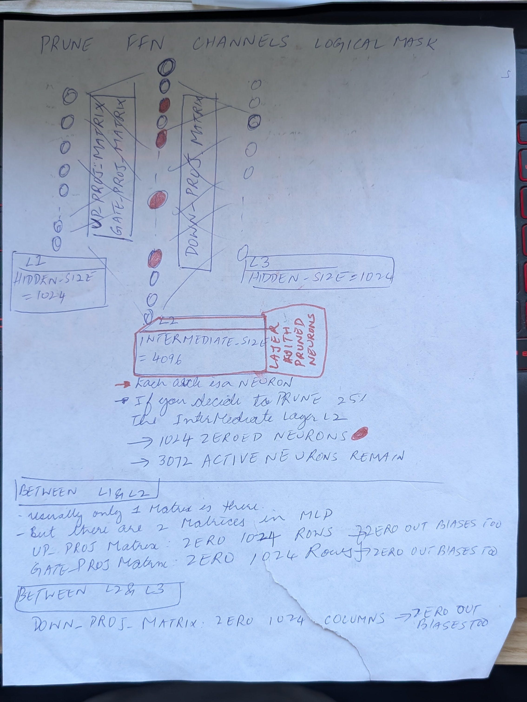

# STRUCTURED PRUNING
T2_structured_pruning/demo2_structured_pruning_ksw.ipynb

This NOTEBOOK Deals with 5 major paradigms
1) Structured Pruning
2) Finetuning
3) LORA for Finetuning
4) Gradient Accumulation
5) Mixed Precision Training
6) How to convert a CIFAR Dataset to VQA Model Dataset

## 🎯 1) STRUCTURED PRUNING
- 🎯   the code see section 4, 5 and 8

- 🎯 While Pruning Qwen/any transformer it is best to prune out only one at a time. Either Attention heads or FFN Layer. This way you can isolate the effect of pruning one layer at a time

- 🎯 ATTENTION HEAD PRUNING: 
    - some percentage of attention heads are pruned. 
    - this prunes the q_proj, k_proj, v_proj and o_proj layers

- 🎯 FFN/ MLP PRUNING
    - FFN: feed forward network. MLP: multi layer perceptron. Both refer to the same layer in the QWEN/Transformer
    - this prunes some neurons in a fully connected network
      - lets say layer 1 has 20 Neurons, layer 2 has 100 neurons, layer 3  has 20 neurons
      - so weight matrix between L1-L2 is 20x100 dimension. between L2-L1, 100x20 dimension
      - if you decide to prune 20% of the middle layer. then 20 neurons in the middle layer will be made zero
    - 🎯 STRUCTURED PRUNING : TYPE A (MATRIX ZEROED , BUT NOT PRUNED)
      - you zero out the 20% neurons on middle layer,but dont erase them. 
      - So matrix sizes remain the same. eight matrix between L1-L2 is 20x100 dimension. between L2-L1, 100x20 dimension
    - 🎯 STRUCTURED PRUNING : TYPE B (MATRIX ZEROED , & PRUNED)
      - you zero out the 20% neurons on middle layer, AND ERASE THEM AND ERASE THEIR CONNECTION  on either side. i.e erase connections from layer2 to layer 1. erase connections from layer 2 to layer 3
      - So matrix sizes SHRINK. eight matrix between L1-L2 is 20x80 dimension. between L2-L1, 80x20 dimension
    -🎯 WHY PRUNE LAYER 2 ?
        - Layer 2 is a good choice to prune because layer 1 and layer 3 dimensions are typicially the same as embedding dimension/hidden dimension. pruning layer 1 or layer3 would affect the embedding dimension. 
        - Layer 2 can be pruned without affecting anything else.

 

## 🎯 2) FINETUNING
- Fine tuning doesnt necessarily mean tuning only a subset of weights (while the rest are frozen). You could fine tune a subset of unfrozen weights, or you could fine tune the entire network
- fine tuning usually means you starting from a pretrained checkpoint of weights. Then you train the network on a smaller dataset for a specific task
    - Example 1:  take a foundation model and specifically for automotive tasks by training it on automotive data
    - Example 2: Take a LLM and train it on finance tasks, or medical tasks
    - Example 3: Take a vision language model and train it on soccer data, for soccer player tracking
- fine tuning can be done on an unpruned model/ or a pruned model
- fine tuning can be done using lora/ or it can be done without lora using any othe method to update the weights

## 🎯 6) CREATE TOY VQA DATASET
- usually we've used CIFAR in the context of image classification etc
- see section 6 of code to see how the simple CIFAR dataset was used to create a VQA dataset. Vision-Question-Answering dataset
 - make_examples
 - encode dataset for VQA
 - dataloader with padding and collation