# 🎯  LORA: LOW RANK ADAPTATION

## 🎯 1) REFERENCES/ CITATIONS
This README is intended to (quickly) document and compile my learning on LORA from various sources. \
LORA: Info and Screenshots from the following
- EDWARD HU: https://www.youtube.com/watch?v=DhRoTONcyZE&t=34s
- Mark Hennings: https://www.youtube.com/watch?v=t1caDsMzWBk

## 🎯 2) LORA OVERVIEW: EDWARD HU
🎯 video by the author EDWARD HU: https://www.youtube.com/watch?v=DhRoTONcyZE&t=34s

LORA
- Technique for fine tuning LLMs. 
- It drastically reduces the number of parameters that have to be updated. see section 3.3 to see how this is achieved
- Between the original model and full fine tuning, everything is LORA in between


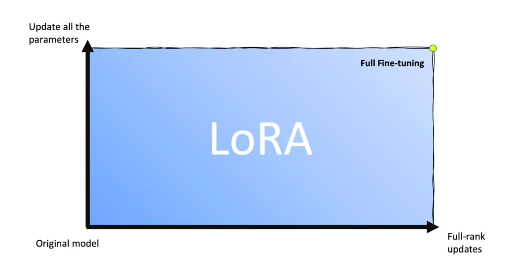
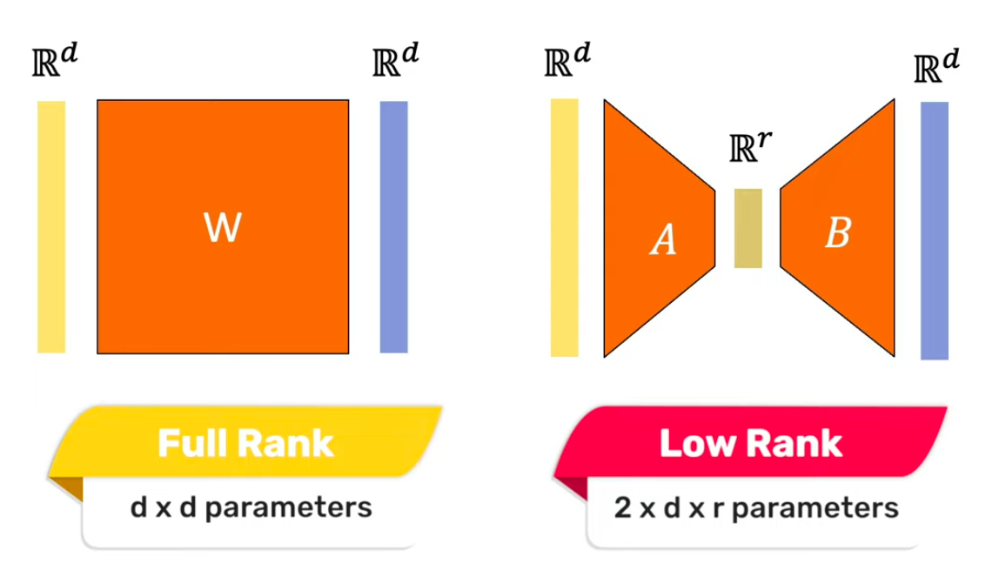
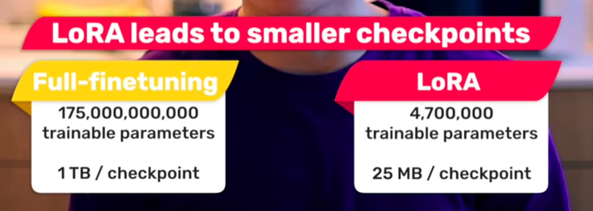

- 🎯 Training: there are additional matrices
- 🎯 Inference: LORA updates are additive, no additional matrices. You run inference the same way as the original way. But with LORA inference is much faster
- the checkpoints are much smaller

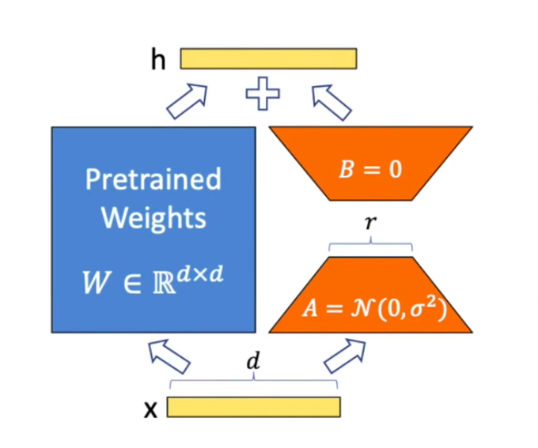
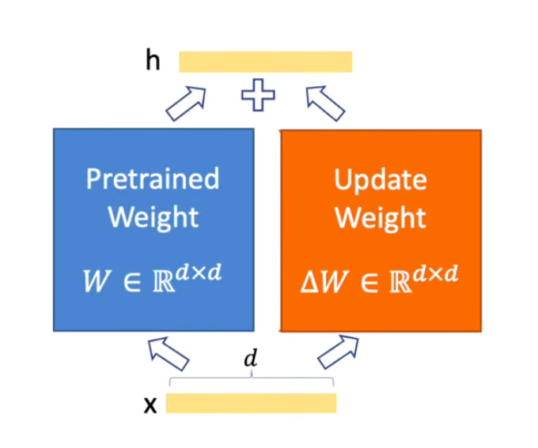
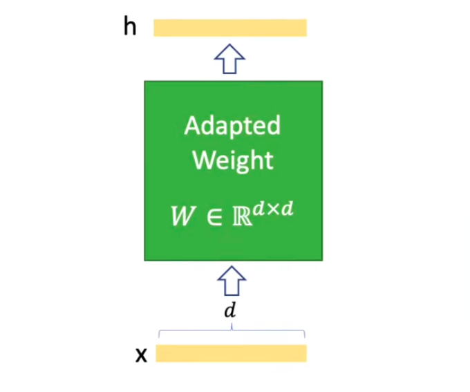


### 🎯 2.1) OTHER ADVANCED IDEAS
- You can cache many LORA models in RAM. When running inference, you can just switch the models between RAM and VRAM (Ram is much larger than VRAM)
- You can also train several LORA modules parallely in a batch, based on the input


## 🎯 3) LORA DETAILS: MARK HENNINGS
🎯 Youtube video by Mark Hennings: https://www.youtube.com/watch?v=t1caDsMzWBk

### 🎯 3.1) TRAINING AN LLM

- PRE TRAINING: Train a base model on a lot of data. like 2 Trillion Tokens
- FINE TUNING-1: pretty much anything you do after on a smaller amount of data 
   - INSTRUCT TUNING: like GPT etc.
   - SAFETY TUNING
   - TASK FINE TUNING
- FINE TUNING-2: pretty much anything you do after on a smaller amount of data 
   - DOMAIN TUNING: like training it for LAW etc..
   - SAFETY TUNING
   - TASK FINE TUNING
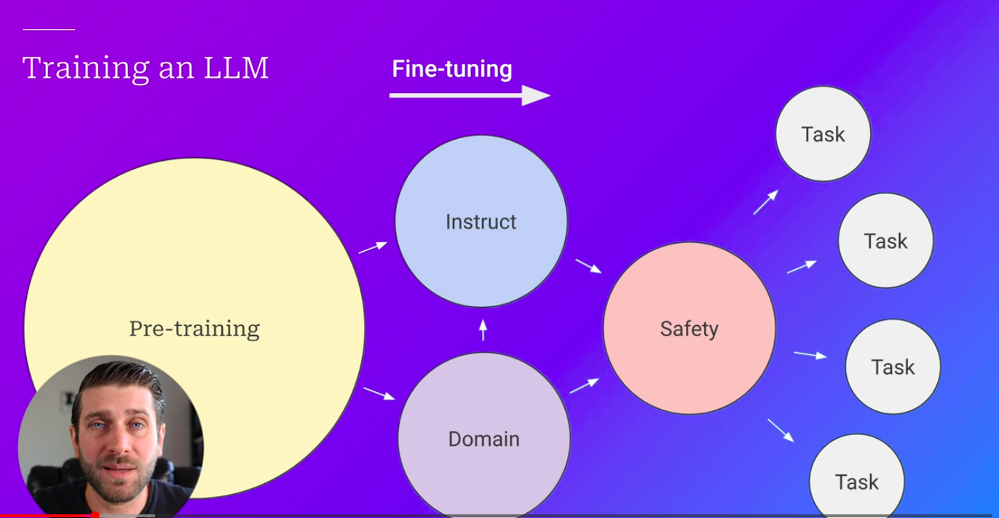


### 🎯 3.2) FULL PARAMETER FINE TUNING
- updates all the model weights. 
- weight matrices are very large. 7B parameter model has 7B weights, 13B parameter model has 13B weights etc
- PROBLEM: all these weights get updated REPEATEDELY IN EVERY EPOCH ! (YEAH 7B updates per epoch ). If you want to go through your entire batch like 100 times, that is 100 epochs. total of 700B updates (WOW !)
- so you can do this only on very very large GPUs


### 🎯 3.3) SOLUTION: ENTER LORA
- Lora does not update the weight, it keeps track of only the changes to the weight- DELTA-W
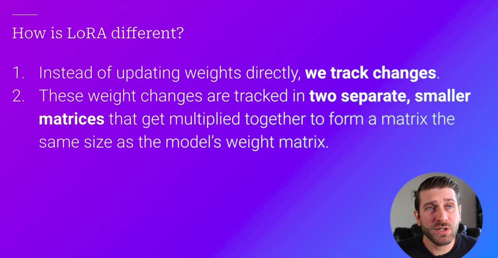

- Instead of having one large matrix with the changes to the weight (DELTA-W ), we use Matrix decomposition to get 2 smaller matrices . These 2 low rank matrices when combined give the DELTA-W matrix
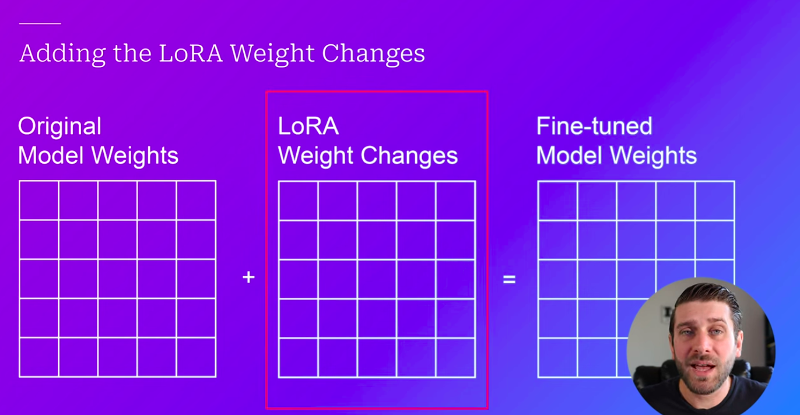
- so instead of 5*5 = 25 weight Delta-W matrix, you can use  5*1 and 1*5 low rank matrix . So that is 5+5 = 10 parameters instead of 25
- you can also increase the rank to 5*2 and 2*5 to get a 5*5 matrix. that would be 10+10 = 20 parameters instead of 25. 
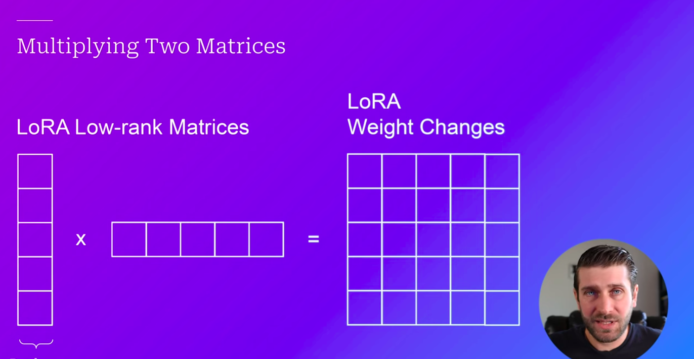 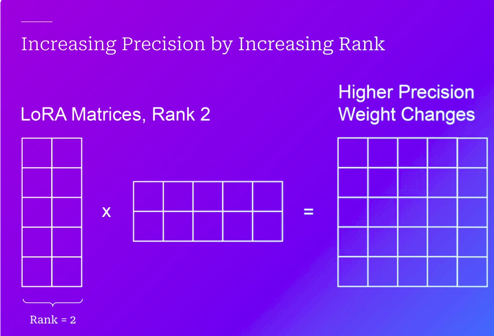
- these are toy examples, but you can imagine the gains when you are dealing with a matrix of billions of parameters. Thats how using LORA the number of parameters needed to update are reduced

Before LORA
```
W_new = W_old + delta-W
output = x @ W_new 
```

After LORA
```
# Now we decompose delta-w which is a large matrix, into 2 low rank matrices A, B
# A,B are small trainabl. e matrices
delta-W = A @ B
# Hence output now
output = x @ W_old + x @ (A @ B)
```


### 3.4) RANK in LORA. 
What should the rank be

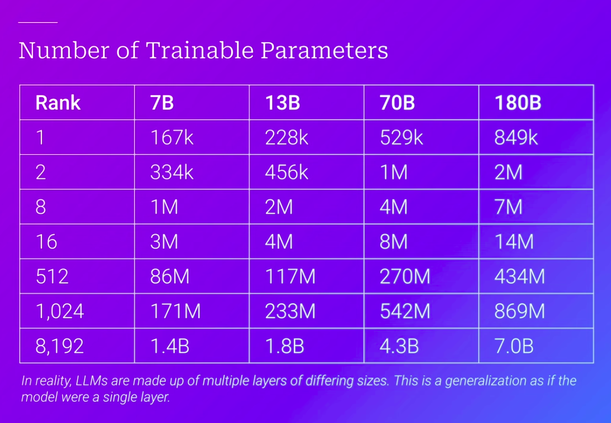 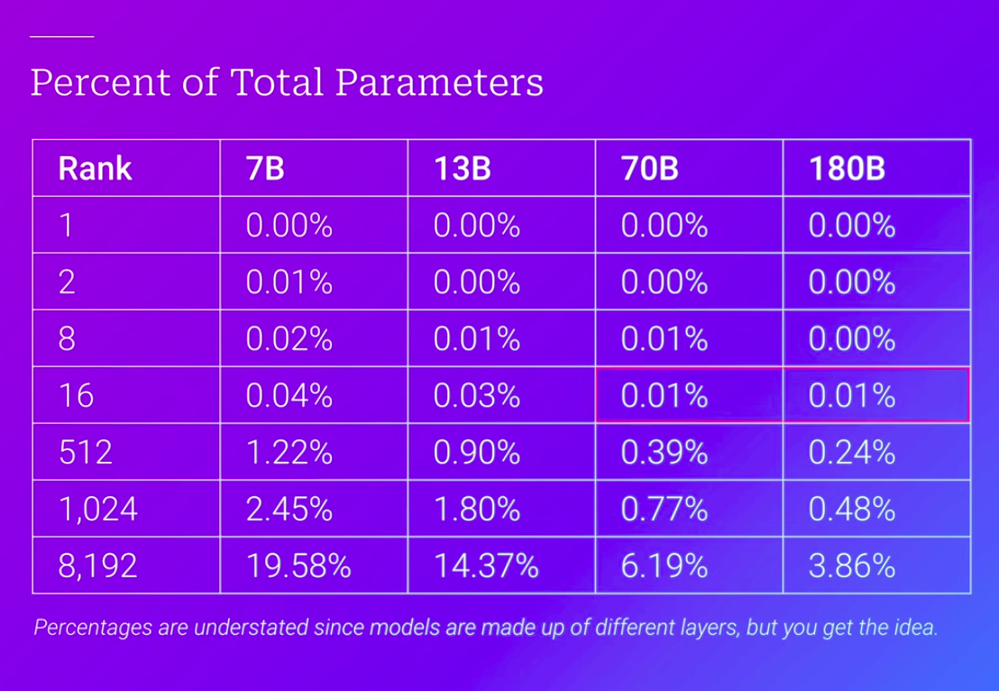
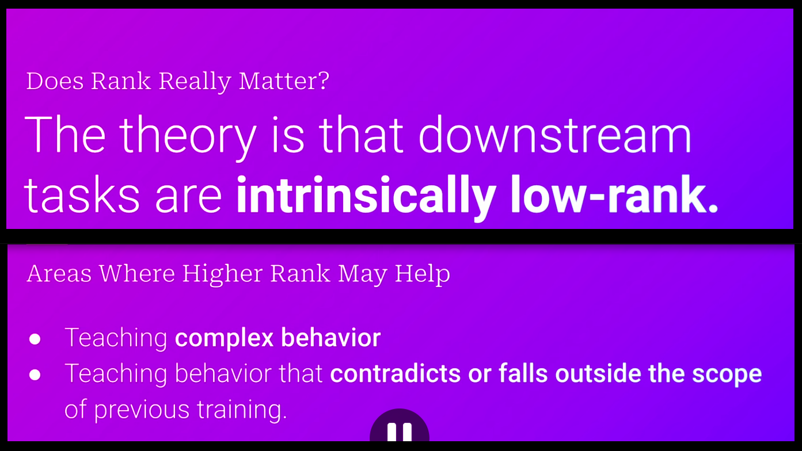 


### 3.5) EXAMPLE LORA SAVINGS !
- Assume Delta-W was originally 2048 x2048 matrix. So that is 4.2 Million Parameters
- Lets use Rank = 16. This will decompose Delta-W into a Matrix A : 2048 x16 , Matrix B: 16 x 2048
- Matrix A and B have 32K parameters each. So total 64 K parameters
- LORA reduced the number of parameters from 4.2 million to 64 thousand ! Hence we no longer need as much compute GPU power

### 3.6) QLORA: QUANTIZED LORA
 