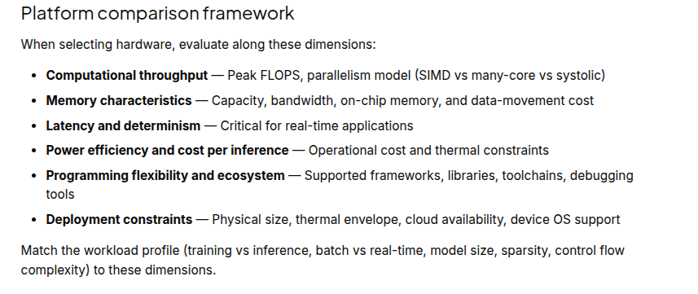

# MARRY THE MODEL-DATA-HARDWARE

See handwritten notes and enter it here
Data: kitti, nuscenes, waymo for lida
Model: pointpillars
Hardware: RTX3050, A100, H100, Nvidia-Jetson-Orin, Nvidia-Jetson-Thor, Nvidia-Drive-Orin, Nvidia-Drive-Thor

Quantify Behviour: Flops, Tops, Power
---------
source udacity
https://learn.udacity.com/nd446?version=1.0.2&partKey=cd14454&lessonKey=e3e0926d-e530-4ea9-ad15-77572a17366e&conceptKey=d5bf90f9-7da9-454f-907b-6d5d8bd08d46
