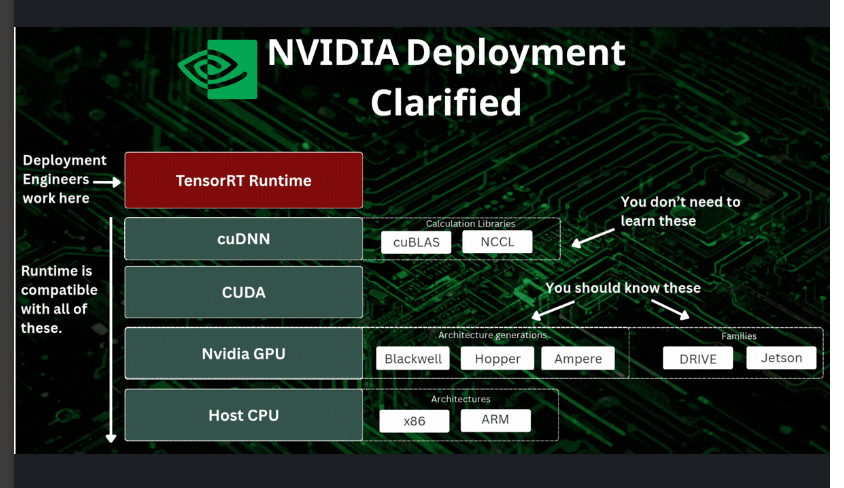

## 1 TensorRT
### What is TensorRT. Is it Software or Hardware Where does it sit in the NVIDIA-CUDA ecosystem
I
TensorRT is a software. It is Nvidia's Inference Engine , designed to run with NVIDIA GPUs. \
More precisely, TensorRT includes:
- an optimizer
- an engine builder
- a runtime inference engine

This is great write up by Jeremy Cohen is everything that you need to know
https://www.linkedin.com/posts/jeremycohen2626_nvidia-ecosystem-is-so-confusing-cuda-share-7465332919209750528-lCuj/?utm_source=share&utm_medium=member_desktop&rcm=ACoAAALT02gBSzTVt465ME3bzlVEWjFIzshUbzQ

Citation: Slide from Jeremy Cohen

## 2. ONNX
### If using TensorRT, Where does ONNX fit in.  Why is ONNX Needed. Is it Hardware or Software
- ONNX is software
- ONNX sits between Pytorch Models and TensorRT
- More generally ONNX is an intermediate model format for portability

### ONNX : CONVERTING BETWEEN FORMATS
  - Models originally could be in Pytorch, Tensorflow, Keras, Caffe etc. 
  - If you want to convert from one format to another eg.  Pytorch to Tensorflow . Convert it TO O

## 3. INFERENCE DURING DEPLOYMENT: VARIOUS TYPES
We discuss 3 types
- Pytorch Inference
- tensor_rt: inference from network definition
- tensor_rt: inference from serilaized engine

## Inference from Network Definition
- ONCE: Create a TensorRT Builder and Network: 
- EVERY SINGLE TIME AT RUNTIME : Run inference with the freshly built engine The builder compiles and optimizes the engine on-the-fly at runtime (yes every single time)

## Inference from Serialized Engine
- ONCE: Build the engine once and save to disk. Save to disk by serializing it to a binary file (.engine or .trt)
- RUNTIME: On future runs, deserialize directly from the file. Skip the entire build/optimization phase