# 🎯 HARDWARE ACCELERATION
citation: screenshots are from udacity

## 🎯 1: INTRO TO HARDWARE ACCELERATION

### 🎯 1.1: MOTIVATION FOR HARDWARE ACCELERATION: GPU IS PRECIOUS !
GPUS are an expensive resource
- CLOUD: on the cloud inefficient GPU usage drives up cloud costs
- ON-PREM DEVICES: if the cloud is not being used and it is one premise hardware that is already paid for. The throughtput affects the number of requests (inference requests) that are processed/ served per day
- REAL-TIME Apps: Require consistent low latency/ probably translates to consistent GPU usage

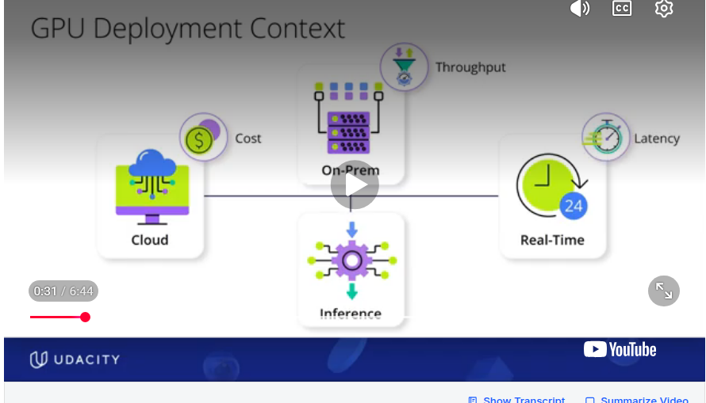

### 🎯 1.2: WAYS TO OPTIMIZE GPU: 3 OPTIMIZATION LAYERS
- i)   DISTRIBUTED SCALING : handles coordination across multiple devices. Ex NCCL , Pytorch Distibuted
- ii)  SERVING INFRASTRUCTURE: Manages deployment and API Layer: Ex. RayServe, TorchServe, Trident
- iii) HARDWARE ACCELERATION: Gets most out of the silcon/ the hardware on which inference is being done. THIS COURSE CONCENTRATES ON THIS . Ex TensorRT, LiteRT, ONNX Runtime

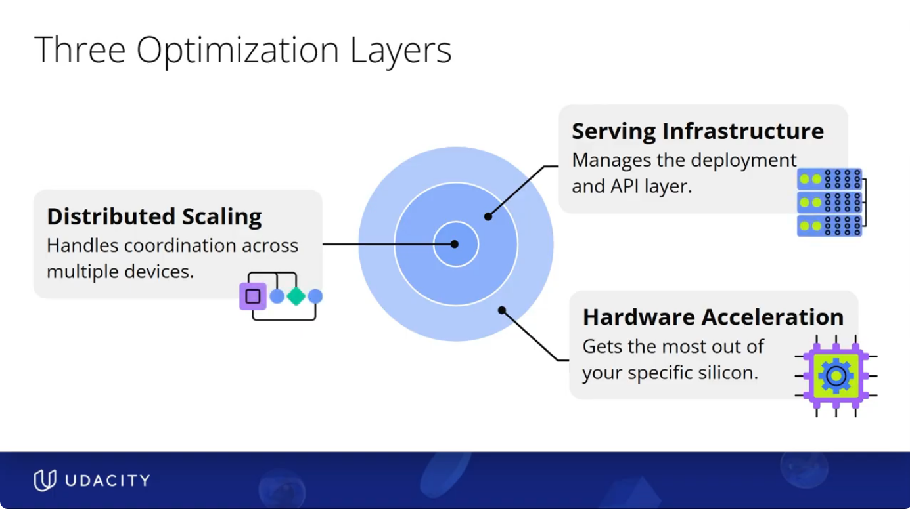

### 🎯 1.3: WHAT ARE HARDWARE ACCELERATORS CAPABLE OF OPTIMIZING? / CORE GPU OPTIMIATION TECHNIQUES
There are 4 core GPU Optimization Techniques
- i) BATCH PROCESSING
     - ideal batch size for gpu parallelism
     - is batch size is too small: GPU remains idle
     - if batch size is too large: GPU out of memory error
     - identifying the correct batch size for the hardware and type of data is the tricky part.
     - Hence DYNAMIC BATCHING is very useful. But not all ML Accelerators support this. Decide on the batch size based on dynamic memory availability
- ii) TENSOR CORE UTILIZATION: 
     - Cuda Cores and Tensor Cores  are present on Nvidia GPU. They are 2 different things
     - **CUDA CORES** = general-purpose workers who can do many types of tasks.
     - **TENSOR CORES** = specialized workers who only do matrix multiplication, but do it extremely fast. They are especially fast on lower precision formats like FP16, BF16, INT8 or even INT4 (depends on the GPU architecture for what format the tensor core supports. Turing/Ampere/Hopper+ support INT4) . Tensor cores are the ones that cause massive speedups
     - Keeping the tensor cores busy is a the core of what inference optimization engines/ ml accelertors like TensorRT, LiteRT etc do
     - The ML accelerators will have to determine which layers can run on the tensor cores and remap memory layouts etc. to be able to run on the tensor cores     
- iii) MIXED PRECISION
- iv)  MEMORY OPTIMIZATION
    - Coalesced vs Scattered: How close the data is to each other and what format
    - NVIDIA likes the NCHW format (Batch number, number of channels, height,width). This aligns with CuDNN, Tensor Core Kernels etc
    - The ML accelerator would habe to take care of conversion from NHWC to NCHW etc.


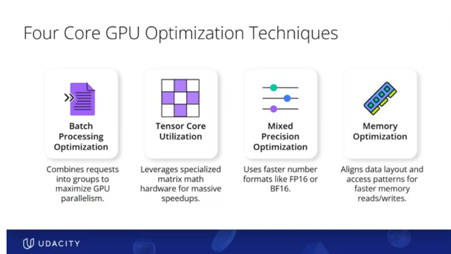
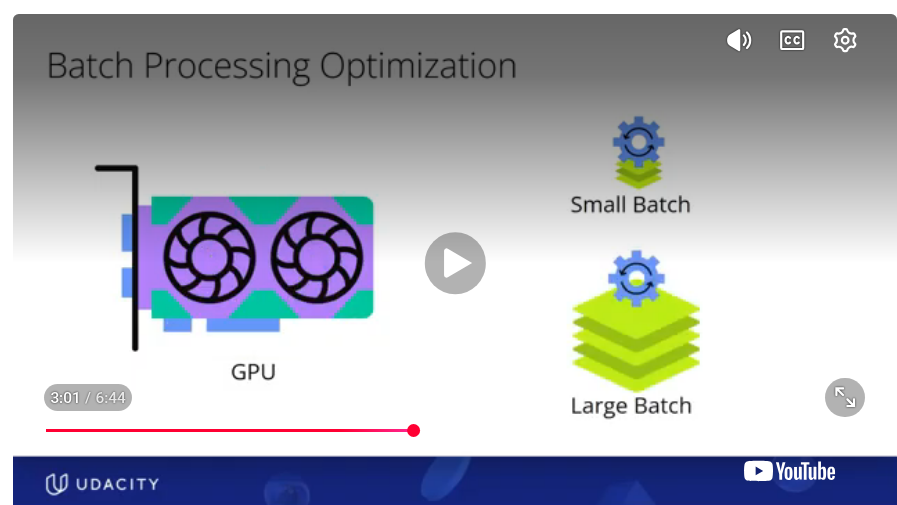 
 
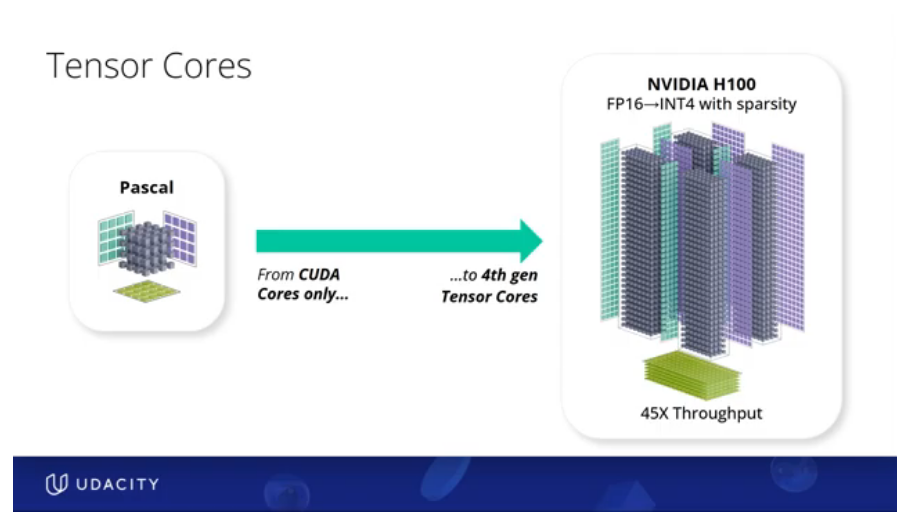 
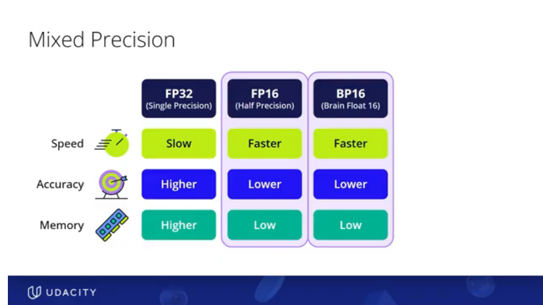 
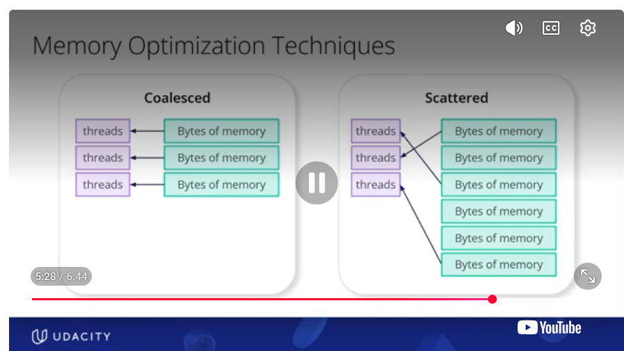

## 🎯 2: ML ACCELERATORS/ HARDWARE ACCELERATOR
   - Hardware accelerators are specific software that marry the model (the software) to the Target Hardware 
   - The apply all sort of optimizations as listed in Section 1.3 to the software model so that performance peaks on the target hardware
   - Examples : TensorRT for Nvidia Hardware, LiteRT for Android Phones
   - TensorRT models have shown to increase performance by 3x-5x times. On LLMs performance has increased 8x compared to the original model


```
MODEL: This is a piece of software
              ⬇
HARDWARE ACCELERATOR: Though this uses the word hardware accelerator, this is also a piece of software. This married the model(software) to the target hardware.
              ⬇
TARGET HARDWARE
```

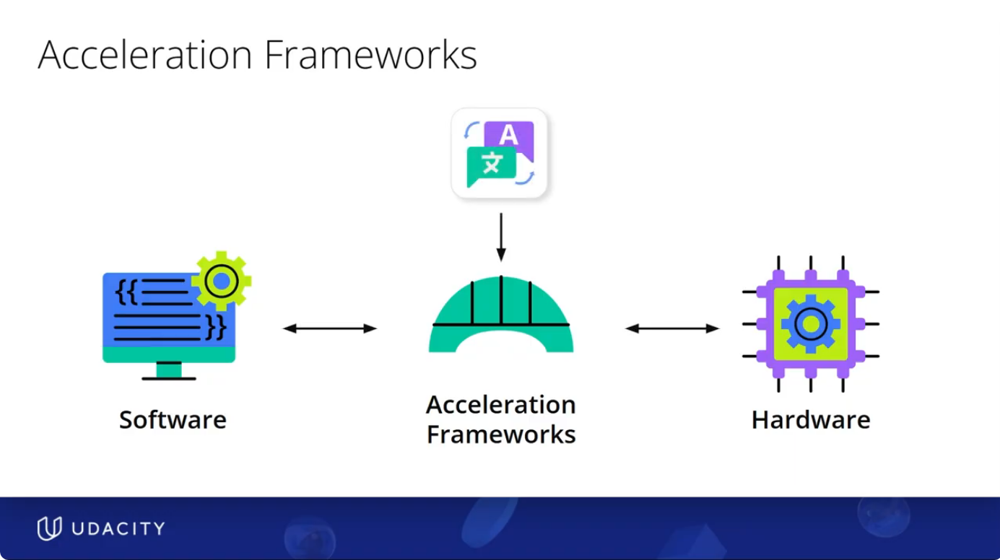 
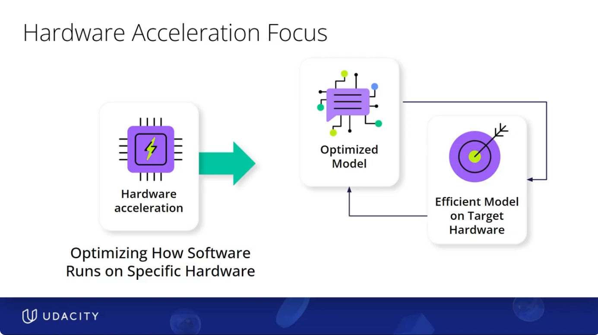


### 🎯 2.1 PRUNING vs. QUANTIZATION vs. HARDWARE ACCELERATION

```
MODEL(Software) ↺ ← PRUNING works on the model(software itself) to optimize the model
      ⬇
MODEL(Software) ↺ ← QUANTIZATION- works on the model(software itself) to optimize the model
      ⬇
HARDWARE ACCELERATOR: Does not work on the model. We want the original model preserved so that we can deploy on different hardwares. Hardware accelerator is target hardware specific. Marries model to target hardware
      ⬇
TARGET HARDWARE
```

## 🎯 3: ML ACCELERATORS/ HARDWARE ACCELERATOR ECOSYSTEM
- Based on the target hardware different ecosystems exist
    - NVIDIA Hardware: TensorRT
    - Android phones/edge devices: LiteRT
    - Apple Phones/ Apple Neural Engine: CoreML
    - Hardware agnostic: ONNX Runtime
    - Intel CPU: Open VINO
- Not all these ml accelerators are capable of performing all 4 GPU optimization techniques. viz batching, tensor core utilization, mixed precision, memory optimization.       
    - They vary widely based on use case and eco system. 
    - For instance Open VINO is a hardware accelerator for Intel CPU inference. So GPU optimizations is irrelevant


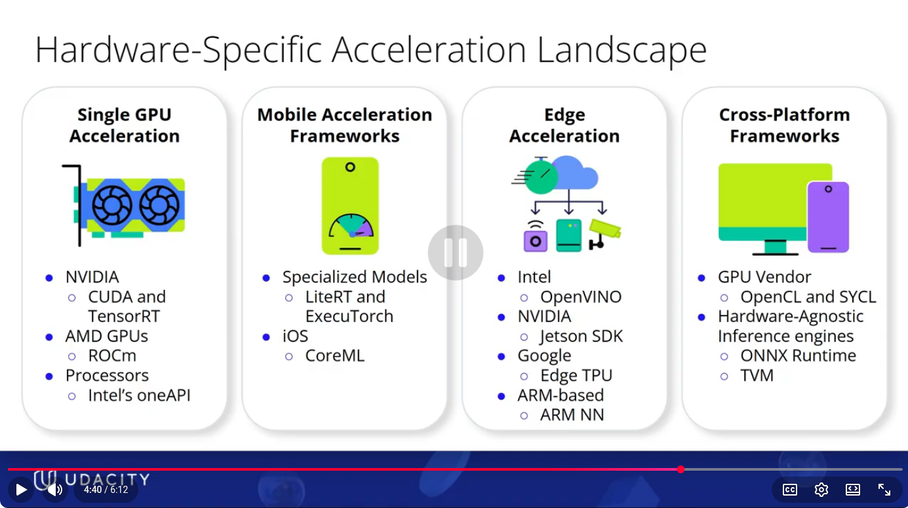


## 🎯 4: TensorRT ML ACCELERATOR: 4 GPU OPTIMIZATIONs
How does TensorRT fare on the 4 GPU Optimizations. For each kof the 4 ways, you set high level parameters  and TensorRT takes care of everything underlying to facilitate it
- **BATCHING**: There is option for Dynamic Batching. Recall that you pass (min, max , most encountered) tensor sized in the tensor rt Exercise 1. This enables dynamic batching. This is an example of how you set high level parameters and TensorRt takes care of things under the hood.
- **MIXED PRECSISION:** not all layers can run onf FP16. Some layers like activations (??) need FP32. TensorRT performs precision calibration using calibration/representative data to automatically detect which layers can work on mixed precision.
- **TENSOR CORE UTILIZATION:** Tensor Core Utilization is at the Core of TensorRT. It detects which layers can run on tensor cores. It rewrites the kernels & memory layout to match tensor core requirements. It fuses kenels like BatchNorm + Relu into single optimized kernels that run fully on tensor cores (instead of any portion running on the gpu core)
- **MEMORY:** After all these Mixed precision and tensor core optimization, if memory cannot be accesses properly, it makes evertyhign slow. memory bottle necks have to be avoided .    
        - COALESCED MEMORY: TensorRT ensures that threads access memory in a coalesced way. Nearby threads access nearby memory. Thread 0 accesses byte 0. Thread 1 accesses byte 4, thread 2 accesses byte 8 and so on and so forth
        - SCATTERED MEMORY: Causes memory drops of the order of 4x-5x times.
    - Takes care of any NCHW, NHWC conversion etc and other memory optimizations
    - So TensorRT takes care of the memory access planning and memory layout planning

Tensor RT is great. 
There are the following TRADE OFFS Though
- buildtimes are really long: you will know this based on how long it took to build for exercise 1
- Since it is hardware specific, there isnt much flexibility
- each engine uses extra gpu memory: every loaded .engine file consumes GPU memory independently.
- the .engine contains: optimized computation graph,selected kernels/tactics, layer fusion decisions, weights, metadata
- When loaded: runtime.deserialize_cuda_engine(...).  TensorRT creates an ICudaEngine object. This object occupies GPU memory.

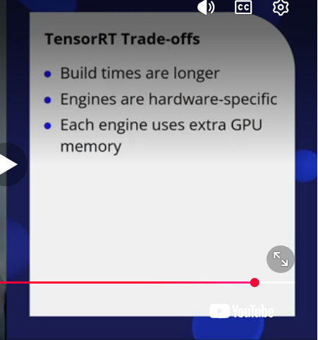

## 🎯 5: OTHER ACCELERATORS: 4 GPU OPTIMIZATIONs

