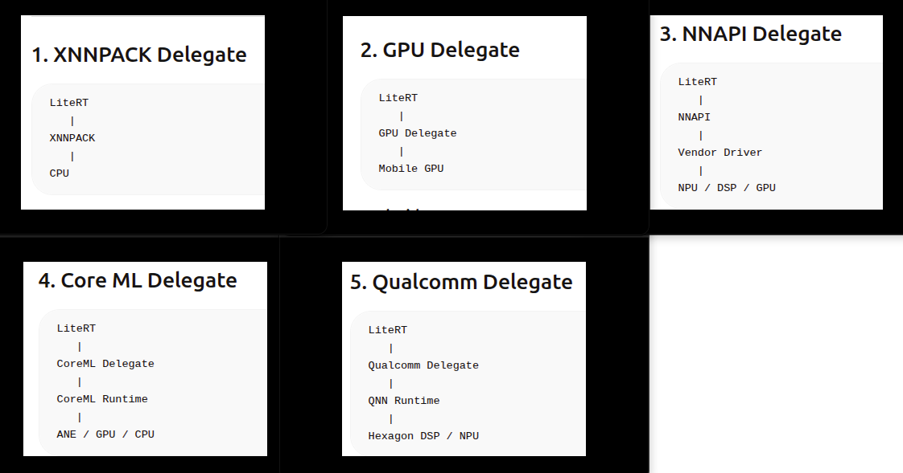
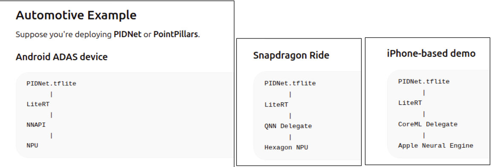
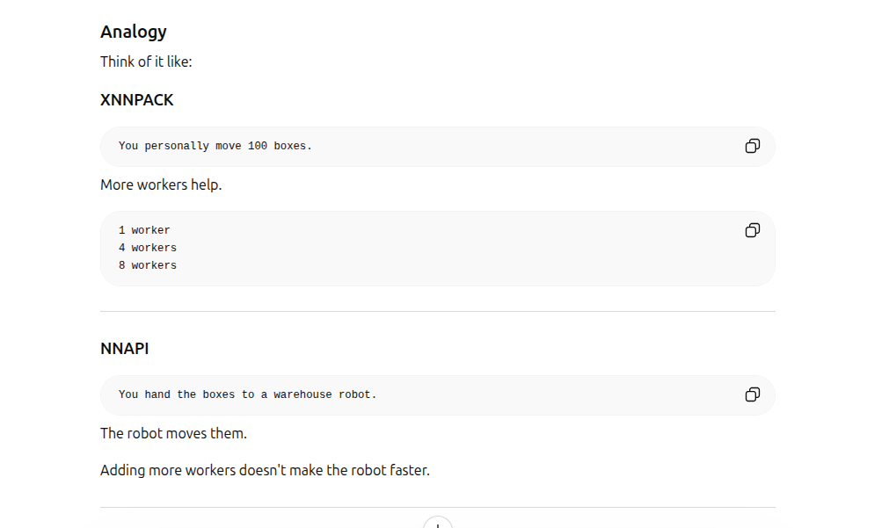

# 🎯 LiteRT


## 🎯 1) LiteRT Overview and LiteRT Interpreter
- LiteRT it the successor to TensorFlow and TFLiTE
  - Tensorflow is the regular good old tensorflow  developed by google, used for model training inference etc. The good old tensorflow that lost its spark to pytorch . LOL ! 😂
  - TensorFlow Lite (TFLite) , developed by google, then came from tensor flow. Used for inference only for android phones/ edge devices
  - LiteRT : successor of TFLITE for android phones/ edge devices

### 🎯 1.1) Gooogle's AI Software Stack: Tensorflow , Tflite are all from google


| Product                  | Purpose                                  | Created By |
| ------------------------ | ---------------------------------------- | ---------- |
| TensorFlow               | Training and inference framework         | Google     |
| TensorFlow Lite (TFLite) | Mobile/edge inference for android phones | Google     |
| LiteRT                   | Successor to TFLite                      | Google     |
| Tensor Processing Unit   | AI accelerator hardware                  | Google     |
| JAX                      | Research/ML framework                    | Google     |


### 🎯 1.2) Interpreter
Interpreter is the LiteRt runtime
- Its a lightweight inference runtime for edge devices/ android phones
- Tensor-Rt too had a runtime- Tensor-RT Runtime. Look for this code in Exercise 1: runtime = trt.Runtime(logger)
- Rutime is the component that is responsible for executing the neural netowrk on the target hardware
  - The Interpreter executes the neural network on the android edge devices, 
  - TensorRT-runtime executes the TensorRT Engine (the neural network) on the NVIDIA edge device
- The Interpreter is inference only


| Framework / Format                   | Runtime            | Typical Invocation          | Created By                             | Stage in ML Pipeline                               | Training / Inference |
| ------------------------------------ | ------------------ | --------------------------- | -------------------------------------- | -------------------------------------------------- | -------------------- |
| PyTorch (`.pt`, `.pth`)              | PyTorch Runtime    | `model(input_tensor)`       | Meta                                   | Model Development, Training, Validation, Inference | Both                 |
| TensorFlow (SavedModel)              | TensorFlow Runtime | `tf.saved_model.load()`     | Google                                 | Model Development, Training, Validation, Inference | Both                 |
| ONNX (`.onnx`)                       | ONNX Runtime       | `ort.InferenceSession()`    | ONNX Project (Microsoft, Meta, others) | Model Exchange & Deployment                        | Primarily Inference  |
| TensorRT (`.engine`)                 | TensorRT Runtime   | `trt.Runtime(logger)`       | NVIDIA                                 | Production Deployment Optimization                 | Inference Only       |
| TensorFlow Lite / LiteRT (`.tflite`) | LiteRT Interpreter | `Interpreter(model_path)`   | Google                                 | Mobile / Edge Deployment                           | Inference Only       |
| OpenVINO (`.xml + .bin`)             | OpenVINO Runtime   | `ov.Core().compile_model()` | Intel                                  | CPU / Edge Deployment                              | Inference Only       |
 


**ONNX Project (originally led by Microsoft & Facebook/Meta)


## 🎯 2) LiteRT Ecosystem (from Google) vs TensorRT Ecosystem (from Nvidia)
Comparison. 
- This is a comparison to understand what is the equivalent in LiteRT for the Tensor-RT Parser, Tensor-RT Builder, Tensor-RT Runtime etc in LiteRT
- Exact equivalents dont exist for everything. But its a good thought experiment to understand things perhaps ??


## 🎯 3) LiteRT Delegate Architecture
LiteRT uses a delegate architecture to offload parts of a neural network graph from the default CPU interpreter to specialized hardware accelerators.

```
            +------------------+
            |   .tflite Model  |
            | (FlatBuffer File)|
            +--------+---------+
                     |
                     v
            +------------------+
            | LiteRT Interpreter|
            +--------+---------+
                     |
          Graph Partitioning
                     |
      +--------------+--------------+
      |                             |
      v                             v
+-------------+             +--------------+
| CPU Kernels |             |   Delegate   |
| (Built-in)  |             |   Backend    |
+-------------+             +--------------+
                                   |
             +---------------------+------------------+
             |                     |                  |
             v                     v                  v
      GPU Delegate       NNAPI Delegate      CoreML Delegate
      (Android)          (Android)           (iPhone/iPad)

```

### Custom Delegate Architecture in LiteRT
- you can build your own custom delegate architecture in LiteRT
- LiteRT (TensorFlow Lite Runtime) was specifically designed to allow hardware vendors and system integrators to create custom delegates.
- The delegate API is essentially a plugin interface between the LiteRT interpreter and an accelerator.

### Why Custom Delegates Exist

Google cannot know every future accelerator:
- Qualcomm DSPs
- Apple Neural Engine
- MediaTek NPUs
- Samsung NPUs
- Automotive ASICs
- FPGA accelerators
- Proprietary AI chips

So LiteRT provides a delegate framework where hardware vendors can implement: \

### Case: Apple Neural Engine & LiteRT
The interesting thing here is Apple Neural Engine. Why would the apple Neural Engine need LiteRt built for android. Apple products use "Core ML"  ?  \
\ 
The Apple Neural Engine (ANE) is not accessed directly by LiteRT. Instead, LiteRT uses the CoreML Delegate, and the CoreML framework decides whether execution runs on:
- CPU
- GPU
- Apple Neural Engine (ANE)

The stack looks like:

```
.tflite
    |
LiteRT Interpreter
    |
CoreML Delegate
    |
CoreML Framework
    |
+-------+-------+-------+
|  CPU  |  GPU  |  ANE  |
+-------+-------+-------+

```

## KSW TODO: Rewrite this section
## 🎯 4) ML Accelerators
### 🎯 4.1) NPU>DSP>GPU> CPU: Where do the exist
- Android ML Accelerators
- IOS ML Accelerators
- Qualcom ML Accelerators

### 🎯 4.1.1) Android hardware accelerator examples
| Accelerator                        | Purpose                       | Typical Vendors                     |
| ---------------------------------- | ----------------------------- | ----------------------------------- |
| **NPU** (Neural Processing Unit)   | AI inference                  | Qualcomm, Google, Samsung, MediaTek |
| **DSP** (Digital Signal Processor) | Signal processing + AI        | Qualcomm Hexagon DSP                |
| **GPU** (Graphics Processing Unit) | Parallel compute and graphics | Adreno, Mali, Immortalis            |
| **CPU** (Central Processing Unit)  | Universal fallback            | ARM Cortex cores                    |


### 🎯 4.2) NPU>DSP>GPU> CPU: performance comparison

| Accelerator Type | Full Name                | Example Hardware                                                          | Best Suited For                                    | Relative Performance | Power Efficiency | Typical Role in LiteRT/NNAPI       |
| ---------------- | ------------------------ | ------------------------------------------------------------------------- | -------------------------------------------------- | -------------------- | ---------------- | ---------------------------------- |
| **NPU**          | Neural Processing Unit   | Qualcomm Hexagon NPU, Google Tensor TPU, MediaTek APU, Samsung Exynos NPU | CNNs, Transformers, Segmentation, Object Detection | Very High            | Very High        | Primary AI accelerator             |
| **DSP**          | Digital Signal Processor | Qualcomm Hexagon DSP                                                      | Audio AI, Vision AI, Sensor Fusion                 | High                 | High             | Low-power AI and signal processing |
| **GPU**          | Graphics Processing Unit | Adreno, Mali, Immortalis                                                  | Parallel tensor operations, CNN inference          | High                 | Medium           | General-purpose AI acceleration    |
| **CPU**          | Central Processing Unit  | ARM Cortex-X, Cortex-A series                                             | Any model (fallback path)                          | Low-Medium           | Low              | Universal fallback execution       |


| Metric             | NPU       | DSP       | GPU      | CPU                       |
| ------------------ | --------- | --------- | -------- | ------------------------- |
| AI Throughput      | ⭐⭐⭐⭐⭐     | ⭐⭐⭐       | ⭐⭐⭐⭐     | ⭐⭐                        |
| Power Efficiency   | ⭐⭐⭐⭐⭐     | ⭐⭐⭐⭐      | ⭐⭐⭐      | ⭐                         |
| Flexibility        | ⭐⭐        | ⭐⭐        | ⭐⭐⭐⭐     | ⭐⭐⭐⭐⭐                     |
| Operator Coverage  | ⭐⭐⭐       | ⭐⭐⭐       | ⭐⭐⭐⭐     | ⭐⭐⭐⭐⭐                     |
| Ease of Deployment | ⭐⭐⭐       | ⭐⭐        | ⭐⭐⭐⭐     | ⭐⭐⭐⭐⭐                     |
| Thermal Behavior   | Excellent | Very Good | Moderate | Poor under sustained load |


### 🎯 4.3) NPU , DSP exist on phones. GPU, CPU live in larger machines like laptops, A100, H100. Is that correct
Answer: No not at all
Phones, laptop, HPC : each can have all 4


## 🎯 5) Code Discussion: Exercise 2: Step 4

### 🎯 5.1) The Mobile Delegates Code
```
def analyze_mobile_litert_ecosystem():
    """
    Comprehensive analysis of LiteRT mobile optimization strategies
    """
    
    print("=== LITERT MOBILE OPTIMIZATION ECOSYSTEM ===")
    print()
    
    # Mobile-specific delegate analysis
    # delegate, platform, benefits, considerations
    mobile_delegates = [
        ("GPU Delegate", 
         "Android GPU/Metal", 
         "3-5x speedup on compatible ops, FP16 preferred", 
         "High power draw, thermal throttling risk"),
        
        ("XNNPACK Delegate", 
         "Optimized CPU kernels", 
         "2-3x CPU speedup, broad compatibility", 
         "Default choice for mobile CPU optimization"),
        
        ("NNAPI Delegate", 
         "Android ML accelerators", 
         "Automatic vendor hardware (DSP/NPU)", 
         "Device-dependent performance, compatibility issues"),
        
        ("Core ML Delegate", 
         "iOS Neural Engine", 
         "Excellent power efficiency on A12+ chips", 
         "iOS-only, limited operation support"),
        
        ("Qualcomm Delegate", 
         "Snapdragon NPU/DSP", 
         "Ultra-low power AI acceleration", 
         "Requires QNN SDK, device-specific"),
    ]

```
### 🎯 5.2) The Mobile Delegates : Call Architecture




| XNNPACK              | GPU Delegate            | NNAPI Delegate         | CoreML Delegate   | Qualcomm(QNN) Delegate |
| -------------------- | ----------------------- | ---------------------- | ----------------- | ---------------------- |
| `.tflite`            | `.tflite`               | `.tflite`              | `.tflite`         | `.tflite`              |
| ↓                    | ↓                       | ↓                      | ↓                 | ↓                      |
| LiteRT               | LiteRT                  | LiteRT                 | LiteRT            | LiteRT                 |
| ↓                    | ↓                       | ↓                      | ↓                 | ↓                      |
| XNNPACK              | GPU Delegate            | NNAPI Delegate         | CoreML Delegate   | QNN Delegate           |
| ↓                    | ↓                       | ↓                      | ↓                 | ↓                      |
| CPU                  | Mobile GPU              | Android Driver         | CoreML Runtime    | QNN Runtime            |
| ↓                    | ↓                       | ↓                      | ↓                 | ↓                      |
| ARM CPU              | Adreno/ Mali/ Apple GPU | NPU / DSP / GPU        | ANE / GPU / CPU   | Hexagon NPU / DSP      |
| Ex.ARM NEON,x86 AVX  | Ex. Android GPU /Metal  |*Android ML accelerators| ios neural engine | Snapdragon NPU/DSP     |


### 🎯 5.2.1) Mobile Delegates: Example: PIDNET deployment
Deployment of PIDNET for various mobile devices
- Android
- Qualcom Snapdragon
- Iphone IOS




### 🎯 5.3) Various Delegates Summary
| Delegate             | Hardware Target                     | Example Hardware                                              | Best For                                              | Latency          | Power Efficiency | Portability                              |
| -------------------- | ----------------------------------- | ------------------------------------------------------------- | ----------------------------------------------------- | ---------------- | ---------------- | ---------------------------------------- |
| **XNNPACK Delegate** | CPU                                 | ARM Cortex CPUs, Apple CPUs, x86 CPUs                         | Universal CPU inference, fallback execution           | Medium           | Medium           | Excellent (Android, iOS, Linux, Windows) |
| **GPU Delegate**     | Mobile GPU                          | Adreno, Mali, Apple GPU                                       | High-throughput CNNs, vision models, image processing | Fast             | Medium-Low       | Good                                     |
| **NNAPI Delegate**   | Android NPU / DSP / GPU / CPU       | Google Tensor, MediaTek Dimensity, Samsung Exynos, Snapdragon | Android devices with vendor AI accelerators           | Fast – Very Fast | High             | Android Only                             |
| **CoreML Delegate**  | Apple Neural Engine (ANE), GPU, CPU | Apple A17 Pro, A18, M1/M2/M3/M4 series                        | iPhone/iPad deployment, Apple ecosystem AI            | Very Fast        | Very High        | iOS/macOS Only                           |
| **QNN Delegate**     | Qualcomm Hexagon NPU / DSP          | Snapdragon 8 Gen 3, Snapdragon X Elite, Snapdragon Ride       | Snapdragon phones, XR devices, automotive platforms   | Very Fast        | Very High        | Qualcomm Only                            |

## 🎯 6.1) Delegates: Precision & Number of Threads

| Delegate             | Hardware Target       | Primary Hardware               | Recommended Precision   | FP32 Support | FP16 Support        | INT8 Support | Recommended Threads | Notes                                                  |
| -------------------- | --------------------- | ------------------------------ | ----------------------- | ------------ | ------------------- | ------------ | ------------------- | ------------------------------------------------------ |
| **XNNPACK Delegate** | CPU                   | ARM Cortex, Apple CPU, x86 CPU | FP32 (baseline) or INT8 | ✓✓✓          | ✓ (limited benefit) | ✓✓✓          | **2–4**             | CPU backend benefits most from threading               |
| **GPU Delegate**     | GPU                   | Adreno, Mali, Apple GPU        | FP16                    | ✓            | ✓✓✓                 | Limited      | **1**               | GPU provides its own parallelism; FP16 usually fastest |
| **NNAPI Delegate**   | Android Accelerators  | NPU / DSP / GPU / CPU          | INT8 or FP16            | ✓            | ✓✓                  | ✓✓✓          | **1**               | Android runtime schedules execution                    |
| **CoreML Delegate**  | Apple Accelerators    | ANE / GPU / CPU                | FP16                    | ✓            | ✓✓✓                 | ✓            | **1**               | Apple Neural Engine strongly favors FP16               |
| **QNN Delegate**     | Qualcomm Accelerators | Hexagon NPU / DSP              | INT8                    | ✓            | ✓                   | ✓✓✓          | **1**               | Qualcomm AI hardware optimized for INT8                |

### 🎯 6.1) LiteRT: Number of Threads
- LiteRT controls CPU threads. It has no contol over NPU, GPU or DSP
- Hence num_threads parameter is relevant for LiteRT CPU kernels,  XNNPACK CPU kernels only. 
- num_threads does not affect NNAPI, CoreML, Qualcom Delegate or GPU Delegate




### 💡 6.2) Thought Experiment: Apple-FP16 vs Android INT8. Is Apple Superior ???
Question: Is Apple Superior ?
- android phones with Android ML accelerators: NPU/DSP/GPU/CPU use int 8 
- android phones with Snapdragon Hexagon NPU/DSP. use INT8 
- apple iphones with Apple ANE/GPU/CPU: use fp16
Apple Phones seem to use FP16. Android INT8. FP16 is typically better than INT8 for accuracy. Does that make apple better ?

Answer : \
1) The bulleted statements above are not entirely accurate. There are nuances. see Below
- android phones with Android ML accelerators: NPU/DSP/GPU/CPU 
   - these are optimized to use INT8 only with the NNAPI delegate. (can use fp16,fp32. but optimized for int8) 
   - Without the NNAPI delegate they could be optimized for anything, but INT8 is typically the favourite
- android phones with Qualcomm Snapdragon Hexagon NPU/DSP. 
   - Qualcomm is heavily optimized to use INT8 regardless of qnn_delegate (can use fp16,fp32. but optimized for int8)
- apple iphones with Apple ANE/GPU/CPU: use fp16
  - Apple CPU: heavily optimized to use FP16 regardless of coreml delegate (can use int8,fp32. but optimized for fp16)
  - Apple GPU: heavily optimized to use FP16 regardless of coreml delegate (can use int8,fp32. but optimized for fp16)
  - Apple ANE: Apple Neural Engine is typically not exposed. It has to be accessed through Coreml , which is optimized for fp16 again. (can use int8,fp32. but optimized for fp16)

2) FP16 vs INT8 accuracy 
   - FP16 accuracy > INT8 accuracy only on the same hardware, for the exact same model. This accuracy difference can often be pretty small
   - F16 accuracy on Apple vs INT8 on Qualcomm Snapdragon is not an apple to apple comparison. This is because because many other factors matter:
        - Compiler optimizations
        - Operator implementations
        - Quantization scheme
        - Calibration dataset
        - Memory bandwidth
        - Runtime

Long Story Short: Apple, Qualcomm, Android with or without Qualcomm can all be good/bad based on what you are tryin to do. There really isnt a single winner 😅

### 🎯 THE END 😅 ! 
Unless you are really developing something for android or apple, we must limit the scope right now !!! 
The LiteRT rabbit hole STOPS right here 🔴 🟠 🟡 🟢 🔵 🟣 ⚫ 🟤 ⚪ 🌷🐇🥕🐰✨ ! 
May the LIGHT be with You ✨ !!! 😂